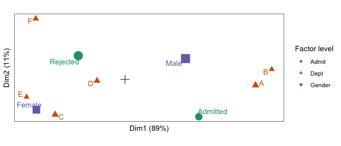

<!-- README.md is generated from README.Rmd. Please edit that file -->

# ordr.extra

<!-- badges: start -->

[](https://lifecycle.r-lib.org/articles/stages.html#experimental)
<!-- badges: end -->

This is an extension of [the **ordr**
package](https://cran.r-project.org/package=ordr), a **tidyverse**
extension for managing ordination models and rendering biplots. **ordr**
provides methods for handling only some of the most common techniques,
so **ordr.extra** provides methods for several additional techniques.

This package is like **broom** in that it can expand to accommodate
additional models until they exceed the bandwidth of its maintainer(s).
See [this issue](https://github.com/corybrunson/ordr.extra/issues/2) for
additional discussion, and please comment with any additional
suggestions!

## installation

**ordr.extra** is not yet on CRAN. You can install the development
version as follows:

``` r
# install.packages("devtools")
devtools::install_github("corybrunson/ordr.extra")
```

Note: This package extends tools from **ordr** to classes of ordination
models from several additional packages, but *it does not depend on
these packages*. The reason is so that someone interested in working
with, say, **candisc** models does not have to also install **ca**,
**PMA**, and the other packages **ordr.extra** supports. The trade-off
is that this user must manually install **candisc** as well.

## example

Joint correspondence analysis[^1], implemented in the **ca** package,
essentially applies PCA to a high-dimensional contingency table
reformatted as a data frame with one observation per row. To illustrate
the technique, recall the UC Berkeley admissions data set, reformatted
here as a data frame of counts:

``` r
# inspect admissions data
head(as.data.frame(UCBAdmissions))
#>      Admit Gender Dept Freq
#> 1 Admitted   Male    A  512
#> 2 Rejected   Male    A  313
#> 3 Admitted Female    A   89
#> 4 Rejected Female    A   19
#> 5 Admitted   Male    B  353
#> 6 Rejected   Male    B  207
```

We can use **ordr** syntax to model these data using joint
correspondence analysis with the function `ca::mjca()`[^2], once we’ve
ensured that **ca** is installed:

``` r
# install {ca} if not already installed
if (! "ca" %in% rownames(installed.packages())) install.packages("ca")
# fit JCA model to admissions data
(admissions_jca <- ordinate(UCBAdmissions, ca::mjca, lambda = "JCA"))
#> # A tbl_ord of class 'mjca': (4526 x 5) x (10 x 5)'
#> # 5 coordinates: Dim1, Dim2, ..., Dim5
#> # 
#> # Rows (standard): [ 4526 x 5 | 4 ]
#>    Dim1  Dim2     Dim3 ... |   name      mass    dist     inertia
#>                            |   <chr>    <dbl>   <dbl>       <dbl>
#> 1  2.77 -1.83 1153938.     | 1 1     0.000221 0.00672     9.97e-9
#> 2  2.77 -1.83 1153938. ... | 2 2     0.000221 0.00672     9.97e-9
#> 3  2.77 -1.83 1153938.     | 3 3     0.000221 0.00672     9.97e-9
#> 4  2.77 -1.83 1153938.     | 4 4     0.000221 0.00672     9.97e-9
#> 5  2.77 -1.83 1153938.     | 5 5     0.000221 0.00672     9.97e-9
#> # ℹ 4,521 more rows
#> # 
#> # Columns (standard): [ 10 x 5 | 6 ]
#>      Dim1    Dim2    Dim3 ... |    name    factor level   mass  dist
#>                               |    <chr>   <chr>  <chr>  <dbl> <dbl>
#>  1  0.934 -1.32    0.933      |  1 Admit:… Admit  Admi… 0.129  0.792
#>  2 -0.591  0.835  -0.591      |  2 Admit:… Admit  Reje… 0.204  0.502
#>  3 -1.12  -1.07    0.904      |  3 Gender… Gender Fema… 0.135  0.784
#>  4  0.765  0.732  -0.616      |  4 Gender… Gender Male  0.198  0.534
#>  5  1.65  -0.208  -0.0687 ... |  5 Dept:A  Dept   A     0.0687 1.22 
#>  6  1.86   0.354   0.687      |  6 Dept:B  Dept   B     0.0431 1.58 
#>  7 -0.884 -1.24   -1.73       |  7 Dept:C  Dept   C     0.0676 1.18 
#>  8 -0.354 -0.0487 -0.107      |  8 Dept:D  Dept   D     0.0583 1.26 
#>  9 -1.25  -0.619  -0.957      |  9 Dept:E  Dept   E     0.0430 1.54 
#> 10 -1.13   2.14    2.65       | 10 Dept:F  Dept   F     0.0526 1.39 
#> # ℹ 1 more variable: inertia <dbl>
```

We can then generate a monoplot[^3] of the group masses for each of the
three categorical variables:

``` r
# build biplot of admissions JCA model with variance distributed to variables
admissions_jca %>%
  confer_inertia("colprincipal") %>%
  ggbiplot() +
  theme_bw() + theme_biplot() +
  geom_origin() +
  geom_cols_point(aes(color = factor, shape = factor, size = mass)) +
  geom_cols_text_repel(aes(label = level, color = factor), show.legend = FALSE) +
  scale_color_brewer(palette = "Dark2") +
  scale_size_area(guide = "none") +
  labs(color = "Factor level", shape = "Factor level")
```



## acknowledgments

See [the **ordr** repo](https://github.com/corybrunson/ordr) for full
acknowledgments.

[^1]: Greenacre MJ (2005) “From Correspondence Analysis to Multiple and
    Joint Correspondence Analysis”. Available at SSRN:
    <https://ssrn.com/abstract=847664>

[^2]: Note that the array is being passed as input. `ca::mjca()` can
    also take data frame input, but it requires a format that differs
    from that produced by `as.data.frame()`.

[^3]: This is a monoplot because JCA is based on the SVD of a
    case-by-variable matrix, and only variable elements are plotted
    here.
