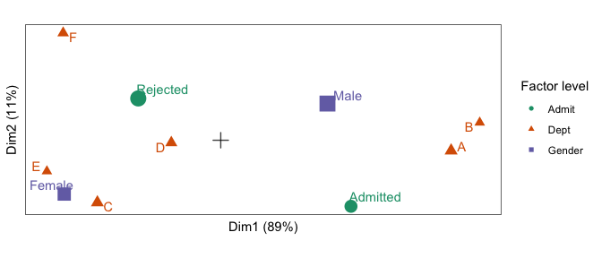

<!-- README.md is generated from README.Rmd. Please edit that file -->

# ordr.extra

<!-- badges: start -->

[](https://lifecycle.r-lib.org/articles/stages.html#experimental)
<!-- badges: end -->

This is an extension of
[**ordr**](https://cran.r-project.org/package=ordr), a **tidyverse**
extension for managing ordination models and rendering biplots. **ordr**
provides methods for handling only some of the most common techniques,
so **ordr.extra** provides methods for several additional techniques.

This package is like **broom**; it can expand to accommodate additional
models until they exceed the bandwidth of its maintainer(s). See [this
issue](https://github.com/corybrunson/ordr.extra/issues/2) for
additional discussion, and please comment with any additional
suggestions!

## installation

**ordr.extra** is not yet on CRAN. You can install the development
version as follows:

``` r
# install.packages("devtools")
devtools::install_github("corybrunson/ordr.extra")
```

## example

Joint correspondence analysis[^1], implemented in the **ca** package,
essentially applies PCA to a high-dimensional contingency table
reformatted as a data frame with one observation per row. To illustrate
the technique, recall the UC Berkeley admissions data set, reformatted
here as a data frame of counts:

``` r
head(as.data.frame(UCBAdmissions))
#>      Admit Gender Dept Freq
#> 1 Admitted   Male    A  512
#> 2 Rejected   Male    A  313
#> 3 Admitted Female    A   89
#> 4 Rejected Female    A   19
#> 5 Admitted   Male    B  353
#> 6 Rejected   Male    B  207
```

We can use **ordr** syntax to model these data using joint
correspondence analysis with the function `ca::mjca()`[^2]:

``` r
admissions_jca <- ordinate(UCBAdmissions, ca::mjca, lambda = "JCA")
#> Warning in type.convert.default(as.character(DF[[i]]), ...): 'as.is' should be
#> specified by the caller; using TRUE

#> Warning in type.convert.default(as.character(DF[[i]]), ...): 'as.is' should be
#> specified by the caller; using TRUE

#> Warning in type.convert.default(as.character(DF[[i]]), ...): 'as.is' should be
#> specified by the caller; using TRUE
```

We can then generate a monoplot[^3] of the group masses for each of the
three categorical variables:

``` r
admissions_jca %>%
  confer_inertia("colprincipal") %>%
  ggbiplot() +
  theme_bw() + theme_biplot() +
  geom_origin() +
  geom_cols_point(aes(color = factor, shape = factor, size = mass)) +
  geom_cols_text_repel(aes(label = level, color = factor), show.legend = FALSE) +
  scale_color_brewer(palette = "Dark2") +
  scale_size_area(guide = "none") +
  labs(color = "Factor level", shape = "Factor level")
```



## acknowledgments

See [the **ordr** repo](https://github.com/corybrunson/ordr) for full
acknowledgments.

[^1]: Greenacre MJ (2005) “From Correspondence Analysis to Multiple and
    Joint Correspondence Analysis”. Available at SSRN:
    <https://ssrn.com/abstract=847664>

[^2]: Note that `ca::mjca()` takes the array as input; it can also take
    a data frame as input, but it must be properly formatted for this
    technique, which `as.data.frame()` does not do.

[^3]: This is a monoplot because JCA is based on the SVD of a
    case-by-variable matrix, and only variable elements are plotted
    here.
