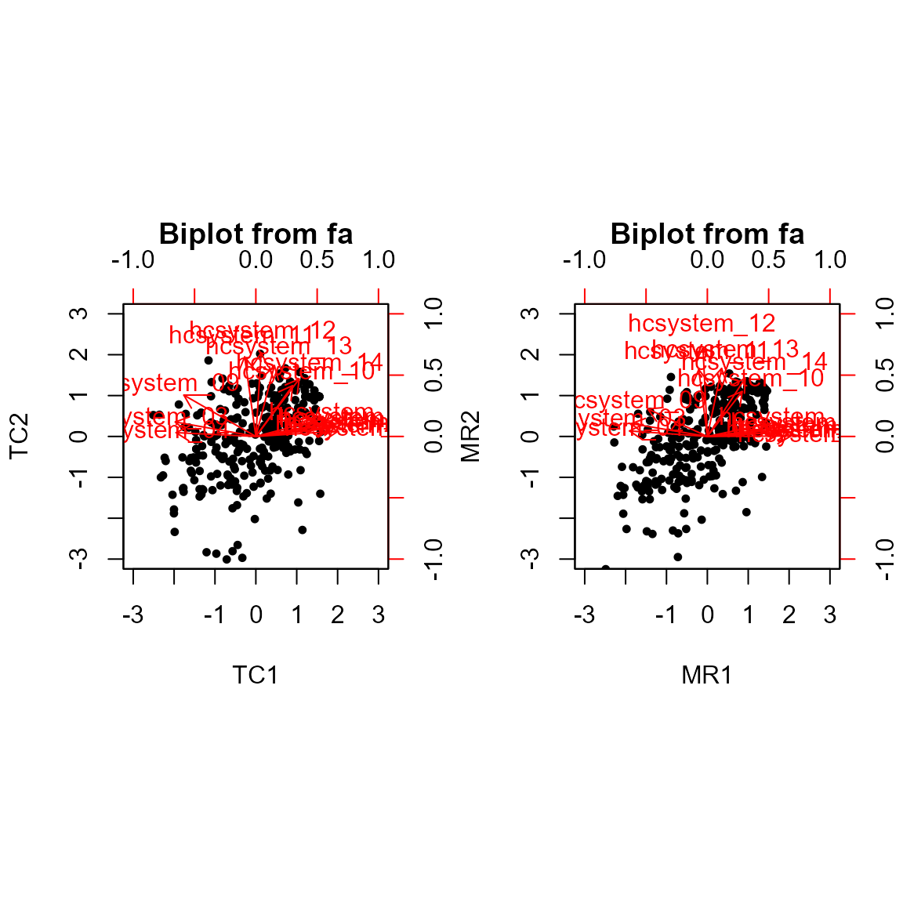
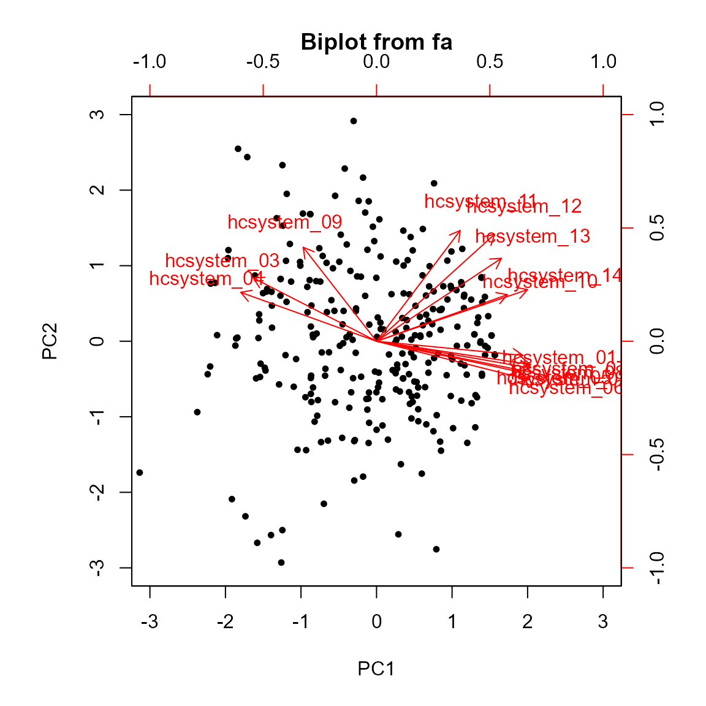

# Extending ordr: Comparison of PCA/FA

## Introduction

This vignette proceeds [Extending ordr:
PCA](vignettes/new-ord-classes-pca) and [Extending ordr:
FA](vignettes/new-ord-classes-fa.md), using the **ordr.extra**
incorporations of
[`psych::principal()`](https://rdrr.io/pkg/psych/man/principal.html) and
[`psych::fa()`](https://rdrr.io/pkg/psych/man/fa.html) to illustrate
some of the similarities and differences between methods at both the
theoretical and practical level.

## Comparison of PCA and FA

``` r
library(ordr.extra) # load {ordr.extra} to access `hcw` data below
```

    Warning: package 'ggplot2' was built under R version 4.3.3

``` r
scaled_hcw <- scale(hcw[, tail(colnames(hcw), 14)])
```

Having demonstrated PCA and FA independently of each other, we now apply
both to one data set for comparison. The data comes from a 2022 study on
burnout in healthcare workers (HCW) during the Covid-19 pandemic
(Guastello et al., 2022). In particular, we use data from a
fourteen-item Likert scale questionnaire, the Healthcare System
Communication Questionnaire, surveying HCW perceptions of hospital
administration. The original study applied PCA followed by an oblimin
rotation (a type of oblique rotation) to the data to examine whether it
had psychometric properties. It was seen that with two principal
components, the questions generally loaded strongly onto just one of the
two components. Those that loaded strongly onto the first principal
component generally pertained to consideration from leadership, and
those that loaded strongly onto the second generally pertained to
structure in the hospital. The principal components were named
accordingly.

We begin by recreating this PCA.

``` r
library(psych) # load {psych}
```

    Attaching package: 'psych'

    The following objects are masked from 'package:ggplot2':

        %+%, alpha

``` r
# conduct PCA
hcw_pca <- scaled_hcw |>
  ordinate(~ principal(., nfactors = 2L, rotate = "oblimin"))
```

    Loading required namespace: GPArotation

``` r
sum(hcw_pca$values[1:2]) / sum(hcw_pca$values[1:14]) # agrees with % variance captured from the paper
```

    [1] 0.6675059

``` r
hcw_pca$loadings
```

    Loadings:
                TC1    TC2   
    hcsystem_01  0.708  0.187
    hcsystem_02  0.825  0.103
    hcsystem_03 -0.821  0.148
    hcsystem_04 -0.813       
    hcsystem_05  0.760       
    hcsystem_06  0.838       
    hcsystem_07  0.783  0.147
    hcsystem_08  0.793  0.126
    hcsystem_09 -0.734  0.421
    hcsystem_10  0.375  0.518
    hcsystem_11 -0.114  0.811
    hcsystem_12         0.852
    hcsystem_13  0.189  0.723
    hcsystem_14  0.442  0.585

                     TC1   TC2
    SS loadings    5.966 2.810
    Proportion Var 0.426 0.201
    Cumulative Var 0.426 0.627

These loadings approximately equal those in Guastello et al., 2022.

Next, we perform FA on the same centered and scaled data, again followed
by an oblimin rotation. We also produce biplots for both analyses.

``` r
# conduct FA
hcw_fa <- scaled_hcw |>
  ordinate(~ fa(., nfactors = 2L, rotate = "oblimin"))

op <- par(mfrow = c(1, 2)) # place biplots side by side

biplot.psych(hcw_pca)
biplot.psych(hcw_fa)
```



``` r
par(op)
```

The biplots are noticeably similar in both the geometry of the variable
vectors and the distribution of observations. Comparing the loadings and
scores from both GDA techniques, we can see that most results do align
quite closely between techniques (we divide the matrices entry-wise so
that values closer to 1 below indicate near-identical entries).

``` r
unclass(hcw_fa$loadings / hcw_pca$loadings) # values close to 1 indicate near equality
```

                       MR1        MR2
    hcsystem_01  0.9838720 0.78102915
    hcsystem_02  1.0243417 0.44683688
    hcsystem_03  0.9431707 0.88462021
    hcsystem_04  0.9748422 1.44717527
    hcsystem_05  0.9891095 0.52403688
    hcsystem_06  1.0156606 0.08313846
    hcsystem_07  1.0084168 0.67198350
    hcsystem_08  1.0111838 0.60436741
    hcsystem_09  0.8263076 0.66466805
    hcsystem_10  0.9467145 0.88460038
    hcsystem_11  0.7694566 0.84057085
    hcsystem_12 -0.8222863 1.06035898
    hcsystem_13  0.7686243 0.96001009
    hcsystem_14  0.8744856 1.01422655

``` r
head(hcw_fa$scores / hcw_pca$scores) # values close to 1 indicate near equality
```

               MR1       MR2
    [1,] 0.7050140 0.7626172
    [2,] 1.0456966 0.8806257
    [3,] 1.2073991 3.1631164
    [4,] 0.7135168 0.8909829
    [5,] 0.9205250 1.4320409
    [6,] 1.1677185 0.8804905

This would suggest that most of the variance in the data is common and
not unique to one variable. In both biplots, the variable vectors are
mostly either close to horizontal or close to vertical, indicating
strong correlations with those nearby variable vectors *and* that most
questions (i.e. variables) load strongly onto exactly one component. In
the loadings matrix below, we see the latter is generally true.

``` r
unclass(hcw_pca$loadings)
```

                        TC1        TC2
    hcsystem_01  0.70835356 0.18672565
    hcsystem_02  0.82520336 0.10291172
    hcsystem_03 -0.82115126 0.14765587
    hcsystem_04 -0.81327679 0.03879340
    hcsystem_05  0.75951523 0.08223227
    hcsystem_06  0.83833332 0.05375802
    hcsystem_07  0.78297867 0.14654429
    hcsystem_08  0.79305986 0.12566448
    hcsystem_09 -0.73377508 0.42136560
    hcsystem_10  0.37469099 0.51801892
    hcsystem_11 -0.11392993 0.81098403
    hcsystem_12  0.05428545 0.85202088
    hcsystem_13  0.18938449 0.72251551
    hcsystem_14  0.44151680 0.58510865

However, the previous biplots are not identical. There is an apparent
elliptical shape to the data in our FA biplot (recall that the goal of
FA is to unveil a “simple structure”). The PCA biplot appears to have
slightly more spread due to PCA’s focus on capturing total variance, not
strictly shared variance as FA does. To see this effect at a slightly
greater degree, we can consider the corresponding PCA with no rotation.

``` r
# unrotated PCA
hcw_unrotated_pca <- scaled_hcw |>
  ordinate(~ principal(., nfactors = 2L, rotate = "none"))
biplot.psych(hcw_unrotated_pca)
```



Not only are the observations spread slightly more, but the data appears
more evenly distributed compared to the previous biplots.

Additionally, most variable vectors in the unrotated PCA biplot no
longer load as clearly onto a single component. This makes it more
challenging to determine the latent variables that explain the variance
in our original variables. In this case, the study from which our data
was obtained termed the two principal components *consideration* and
*structure*, respectively. That PCA as well as the FA we performed both
allow us to easily make statements such as, “Question 4 on the
questionnaire strongly assesses consideration, whilst question 12
strongly assesses structure.” In a PCA without rotation, such
interpretations are not as clear.

Ultimately, we see that FA is useful for obtaining a simply structure
with interpretable latent variables. If we want a similar result that
captures more variance and thus retains more information from the
original data, we may opt for PCA followed by rotation. And if we want
to capture more variance still, perhaps at the expense of
interpretability, then unrotated PCA delivers that.
