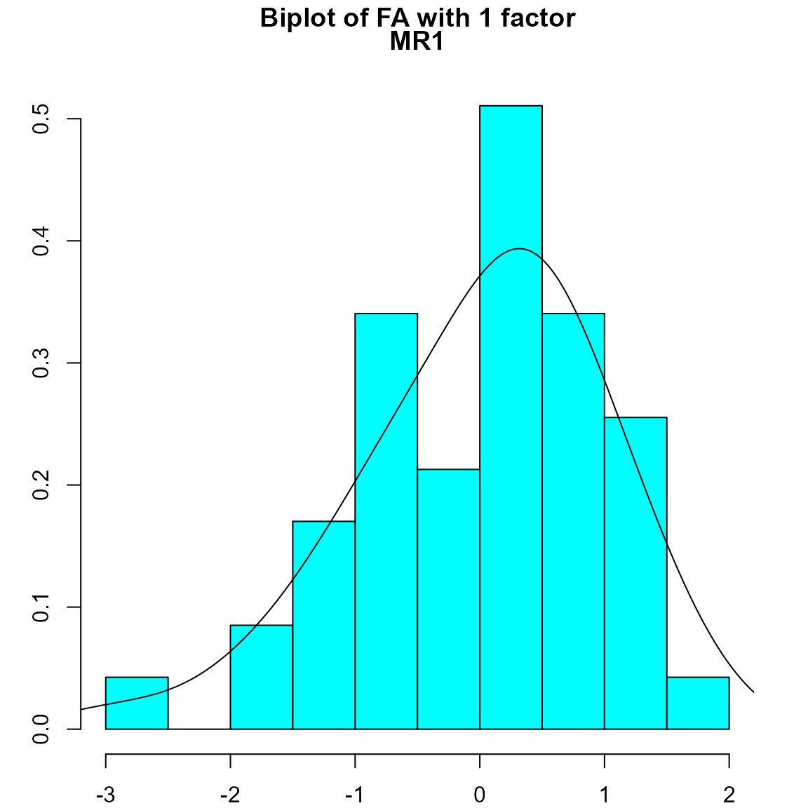
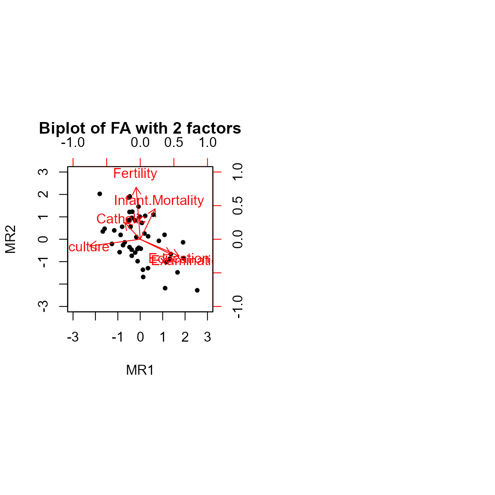
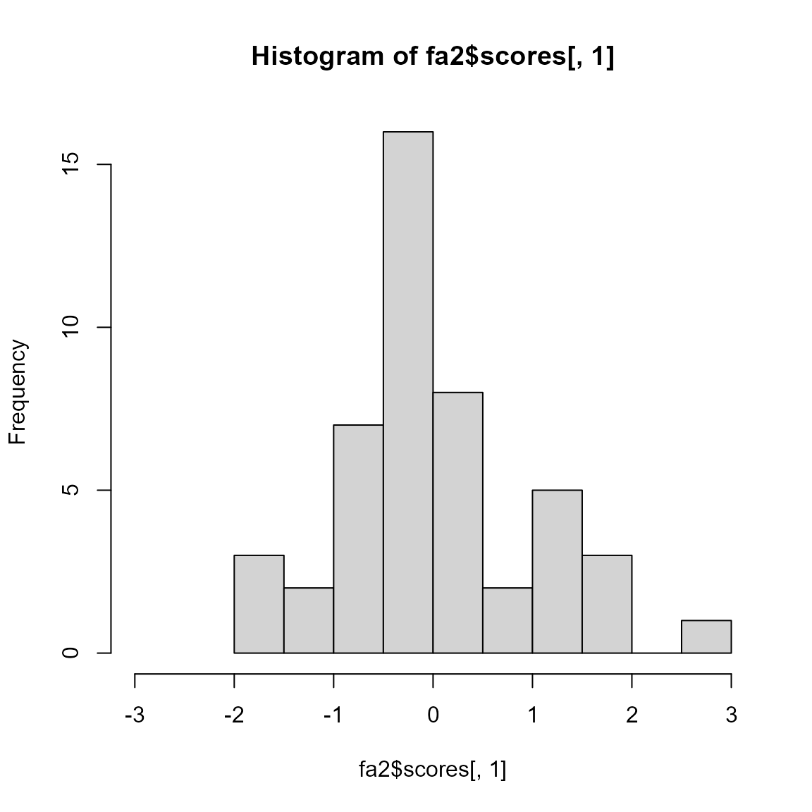
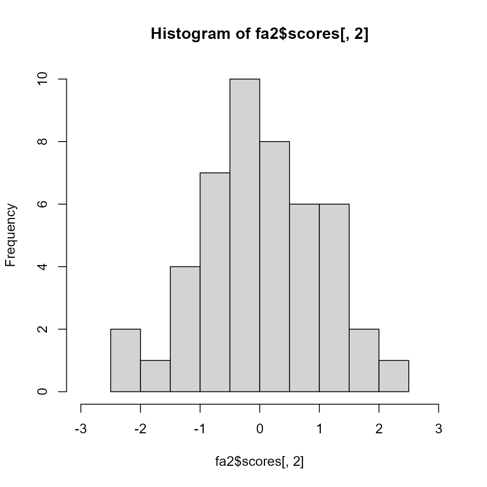

# Extending ordr: FA

## Introduction

This vignette demonstrates how to integrate methods for a new ordination
class into **ordr.extra**. It follows the [principal component analysis
(PCA) vignette](new-ord-classes-pca.md), which for reasons of underlying
theory is a simpler case. Since we’ll refer to the prequel here
occasionally, we recommend beginning there.

``` r
library(ordr)
```

    Warning: package 'ggplot2' was built under R version 4.3.3

``` r
library(psych)
```

### Factor Analysis

Factor analysis (FA) is a family of dimension-reducing methods of
geometric data analysis. Unlike PCA, FA assumes the existence of latent
variables (factors) behind a set of data which may better represent that
data. The number of factors is less than the number of variables
originally taken to be in the set. Like principal components, the
factors in FA are linear combinations of the variables, and the
variables are said to load onto the factors. However, factors are chosen
to explain correlations between the variables, not to capture maximal
variance; it is not assumed that factors are uncorrelated and
orthogonal. For a further description and simple example of FA, see
[here](https://stats.oarc.ucla.edu/spss/seminars/introduction-to-factor-analysis/a-practical-introduction-to-factor-analysis/).

The core R distribution contains
[`stats::factanal()`](https://rdrr.io/r/stats/factanal.html), and
**ordr** already recognizes its output. This vignette focuses on
[`psych::fa()`](https://rdrr.io/pkg/psych/man/fa.html), with `factanal`
methods as points of reference. Its integration into **ordr** will be
much like that of
[`psych::principal()`](https://rdrr.io/pkg/psych/man/principal.html),
due to similarities in the linear algebra and in their interpretations,
but several pitfalls must be avoided.

``` r
scaled_swiss <- scale(swiss)
fa_stats <- factanal(scaled_swiss, factors = 2, rotation = "none", scores = "regression")
(fa_tbl_ord <- as_tbl_ord(fa_stats))
```

    # A tbl_ord of class 'factanal': (47 x 2) x (6 x 2)'
    # 2 coordinates: Factor1 and Factor2
    # 
    # Rows (principal): [ 47 x 2 | 0 ]
      Factor1 Factor2 | 
                      | 
    
[38;5;250m1
[39m   0.115  -
[31m0
[39m
[31m.
[39m
[31m629
[39m | 
    
[38;5;250m2
[39m  -
[31m0
[39m
[31m.
[39m
[31m240
[39m   1.07  | 
    
[38;5;250m3
[39m  -
[31m0
[39m
[31m.
[39m
[31m655
[39m   1.17  | 
    
[38;5;250m4
[39m  -
[31m0
[39m
[31m.
[39m
[31m415
[39m  -
[31m0
[39m
[31m.
[39m
[31m182
[39m | 
    
[38;5;250m5
[39m   0.419  -
[31m0
[39m
[31m.
[39m
[31m646
[39m | 

    # 
    # Columns (principal): [ 6 x 2 | 0 ]
      Factor1 Factor2 | 
                      | 
    
[38;5;250m1
[39m  -
[31m0
[39m
[31m.
[39m
[31m674
[39m  0.356  | 
    
[38;5;250m2
[39m  -
[31m0
[39m
[31m.
[39m
[31m648
[39m  0.297  | 
    
[38;5;250m3
[39m   0.713 -
[31m0
[39m
[31m.
[39m
[31m471
[39m  | 
    
[38;5;250m4
[39m   0.997  0.025
[4m2
[24m | 
    
[38;5;250m5
[39m  -
[31m0
[39m
[31m.
[39m
[31m178
[39m  0.953  | 
    
[38;5;250m6
[39m  -
[31m0
[39m
[31m.
[39m
[31m104
[39m  0.169  | 

### Factor Indeterminacy

FA assumes correlations between the factors, which leads to the issue of
factor indeterminacy: Different optimization procedures may produce
different sets of $k$ factors. Moreover, the factors obtained are not
ranked and may be inconsistent across different choices of $k$. This is
in stark contrast to the fact that the first $l \leq k$ principal
components are the same regardless of $k$. Compare the results using
$k = 1$ and $k = 2$:

``` r
fa1 <- fa(scaled_swiss, nfactors = 1)
fa2 <- fa(scaled_swiss, nfactors = 2)

fa1$loadings
```

    Loadings:
                     MR1   
    Fertility         0.749
    Agriculture       0.683
    Examination      -0.943
    Education        -0.761
    Catholic          0.518
    Infant.Mortality  0.197

                     MR1
    SS loadings    2.801
    Proportion Var 0.467

``` r
fa2$loadings
```

    Loadings:
                     MR1    MR2   
    Fertility                0.965
    Agriculture      -0.944 -0.126
    Examination       0.721 -0.312
    Education         0.576 -0.282
    Catholic         -0.287  0.309
    Infant.Mortality  0.276  0.566

                     MR1   MR2
    SS loadings    1.906 1.539
    Proportion Var 0.318 0.256
    Cumulative Var 0.318 0.574

``` r
par(mfrow = c(1, 2))

fa1 |>
  biplot.psych(main = "Biplot of FA with 1 factor", xlim.s = c(-3,3))
```



``` r
fa2 |>
  biplot.psych(main = "Biplot of FA with 2 factors")
```



Notice that
[`biplot.psych()`](https://rdrr.io/pkg/psych/man/biplot.psych.html)
returns a histogram of factor scores along the single factor in the
first case. Observing where the highest bars lie corresponding to the
horizontal axis, we can see where the data clusters along a latent
variable. Here, we see that the data skews slightly left in the latent
variable. In this way, the histogram provides a visualization similar to
that of a two-dimensional biplot. For further comparison, the score
histograms for the the first, then second, factors of the two-factor
case is below.

``` r
hist(fa2$scores[, 1], xlim = c(-3,3))
```



``` r
hist(fa2$scores[, 2], xlim = c(-3,3))
```



### Matrix Decomposition

Factor analysis is based on the following model:
$$R_{p \times p} = L_{p \times k}\left( L_{p \times k} \right)^{\top} + U_{p \times p}^{2}$$
Note that FA uses the correlation matrix $R$ rather than the covariance
matrix, which can also be obtained by centering and scaling the data:
$$\left( {\bar{X}}_{n \times p} \right)^{\top}{\bar{X}}_{n \times p} = L_{p \times k}\left( L_{p \times k} \right)^{\top} + U_{p \times p}^{2}$$
As with PCA via EVD, we decompose this matrix into the product of a
loadings matrix $L$ and its transpose. However, there is no diagonal
matrix of inertia here, and we add to the decomposition a residuals
matrix $U^{2}$. We can check this on the decomposition returned by
[`psych::fa()`](https://rdrr.io/pkg/psych/man/fa.html):

``` r
# correlation matrix
cor_swiss <- cov(scaled_swiss)
# factor analysis
fa_psych <- 
  psych::fa(r = swiss, nfactors = 2L, rotate = "none", scores = "regression", fm = "ml")
# factor analysis loadings and residuals
L <- fa_psych$loadings
Usquared <- fa_psych$residual
# equivalence
cor_swiss / (L %*% t(L) + Usquared)
```

                     Fertility Agriculture Examination Education Catholic
    Fertility                1           1           1         1        1
    Agriculture              1           1           1         1        1
    Examination              1           1           1         1        1
    Education                1           1           1         1        1
    Catholic                 1           1           1         1        1
    Infant.Mortality         1           1           1         1        1
                     Infant.Mortality
    Fertility                       1
    Agriculture                     1
    Examination                     1
    Education                       1
    Catholic                        1
    Infant.Mortality                1

As mentioned above, the loadings matrix $L$ depends on the FA method;
the `fm` argument selects among 12 methods provided by **psych**. In
this vignette, we’ll hold the method fixed as we expand **ordr** around
this new class, then verify that the expansion accommodates other
methods correctly.

## Recovery Methods

We’ll first assemble the recoverers one by one. Then we’ll write and
test the
[`as_tbl_ord()`](https://corybrunson.github.io/ordr/reference/tbl_ord.html)
method for the payoff.

### Row and Column Elements

As with
[`psych::principal()`](https://rdrr.io/pkg/psych/man/principal.html) we
take the factor loadings as the active column elements and the scores as
supplementary row elements. An additional complication in FA, from a PCA
perspective, is that several methods are available to compute case
scores, based on different choices of weights. The default, regression
scores, uses the weight matrix
$W_{p \times k} = R_{p \times p}^{-1}L_{p \times k}$. The scores are
obtained from the centered data matrix by multiplication on the right,
$S_{n \times k} = {\bar{X}}_{n \times p}W_{p \times k}$.

Check how scores are computed

``` r
# the matrix of 1s indicates equality
(w <- fa_psych$weights) / (solve(cor_swiss) %*% fa_psych$loadings)
```

                     ML1 ML2
    Fertility          1   1
    Agriculture        1   1
    Examination        1   1
    Education          1   1
    Catholic           1   1
    Infant.Mortality   1   1

``` r
# the matrix of 1s indicates equality
head(fa_psych$scores / (scaled_swiss %*% w))
```

                 ML1 ML2
    Courtelary     1   1
    Delemont       1   1
    Franches-Mnt   1   1
    Moutier        1   1
    Neuveville     1   1
    Porrentruy     1   1

The scores do not necessarily multiply with the loadings to recover the
data, but we may obtain a matrix decomposition that justifies their
inclusion as row elements. The weight matrix $W_{p \times k}$ is not
invertible, but the *pseudoinverse*
$W_{k \times p}^{+} = \left( \left( W_{p \times k} \right)^{\top}W_{p \times k} \right)^{-1}\left( W_{p \times k} \right)^{\top}$
is a left inverse in the sense that $W^{+}W = I_{k \times k}$ when $W$
is full-rank and has the nice property that $WW^{+}W = W$. We then have
$S_{n \times k}W_{k \times p}^{+} = {\bar{X}}_{n \times p}W_{p \times k}W_{k \times p}^{+}$—that
is, the scores multiply with the pseudoinverse weights to recover an
idempotent transformation of the scaled data matrix.

Check how the pseudoinverse multiplies with the weights

``` r
# define pseudoinverse W^+
w_inv <- solve(t(w) %*% w) %*% t(w)
# left and right products with W
w_inv %*% w
```

                  ML1           ML2
    ML1  1.000000e+00 -6.585851e-17
    ML2 -1.048966e-17  1.000000e+00

``` r
w %*% w_inv
```

                         Fertility  Agriculture  Examination     Education
    Fertility         0.0031652150  0.002273491 -0.006419596 -0.0071071059
    Agriculture       0.0022734906  0.001633693 -0.004608396 -0.0059375854
    Examination      -0.0064195965 -0.004608396  0.013029860  0.0113058637
    Education        -0.0071071059 -0.005937585  0.011305864  0.9997824760
    Catholic          0.0552983619  0.039612618 -0.112552971  0.0019395106
    Infant.Mortality  0.0006298001  0.000451473 -0.001280686 -0.0003557987
                         Catholic Infant.Mortality
    Fertility         0.055298362     0.0006298001
    Agriculture       0.039612618     0.0004514730
    Examination      -0.112552971    -0.0012806861
    Education         0.001939511    -0.0003557987
    Catholic          0.982262303     0.0111386731
    Infant.Mortality  0.011138673     0.0001264533

``` r
# idempotency of right product
( w %*% w_inv %*% w ) / w
```

                     ML1 ML2
    Fertility          1   1
    Agriculture        1   1
    Examination        1   1
    Education          1   1
    Catholic           1   1
    Infant.Mortality   1   1

This decomposition situates the scores as row elements and also prompts
us to include (the transpose of) the pseudoinverse weight matrix as a
set of supplementary column elements. Indeed,
$\left( W_{k \times p}^{+} \right)^{\top}$ and $L_{p \times k}$ share
the same dimensions, and we can reason that both contain full inertia.

How the same inertia is conferred on $\left( W^{+} \right)^{\top}$ as on
$L$

Let $d$ denote the inertia contained in $X$. Then
$\left( {\bar{X}}_{n \times p} \right)^{\top}{\bar{X}}_{n \times p} = R_{p \times p}$
contains $d^{2}$. Recalling that $L_{p \times k}$ contains $d$, it
follows that $W_{p \times k} = R_{p \times p}^{-1}L_{p \times k}$
contains $d^{-2}d = d^{-1}$. Consequently,
$W_{k \times p}^{+} = \left( \left( W_{p \times k} \right)^{\top}W_{p \times k} \right)^{-1}\left( W_{p \times k} \right)^{\top}$
contains $\left( d^{-2} \right)^{-1}d^{-1} = d^{2}d^{-1} = d$. This is
also consistent with the scores being in standard coordinates, as
determined for
[`psych::principal()`](https://rdrr.io/pkg/psych/man/principal.html).

We can now define the row and column recoverers, largely mimicking those
of the `principal` class:

``` r
# no active row elements
recover_rows.fa <- function(x) {
  matrix(
    nrow = 0, ncol = ncol(x[["loadings"]]),
    dimnames = list(NULL, colnames(x[["loadings"]]))
  )
}
# loadings as active column elements
recover_cols.fa <- function(x) {
  unclass(x[["loadings"]])
}
# scores as supplementary row elements
recover_supp_rows.fa <- function(x) {
  if (is.null(x[["scores"]])) {
    matrix(numeric(0), nrow = 0, ncol = 0)
  }
  else
    x[["scores"]]
}
# transpose pseudoinverse weight matrix as supplementary column elements
recover_supp_cols.fa <- function(x) {
  t( solve(t(x[["weights"]]) %*% x[["weights"]]) %*% t(x[["weights"]]) )
}
# illustrations
recover_cols(fa_psych)
```

                            ML1         ML2
    Fertility        -0.6735975  0.35580312
    Agriculture      -0.6483627  0.29653466
    Examination       0.7127625 -0.47077594
    Education         0.9971812  0.02518276
    Catholic         -0.1783679  0.95263472
    Infant.Mortality -0.1044043  0.16919494

``` r
recover_rows(fa_psych)
```

         ML1 ML2

``` r
recover_supp_cols(fa_psych)
```

                              ML1         ML2
    Fertility        -0.025322043  0.06092793
    Agriculture      -0.019001982  0.04363155
    Examination       0.048319468 -0.12406268
    Education         1.018337287  0.01840992
    Catholic         -0.319151375  1.08434591
    Infant.Mortality -0.004004161  0.01229013

``` r
head(recover_supp_rows(fa_psych))
```

                        ML1        ML2
    Courtelary    0.1149046 -0.6290677
    Delemont     -0.2400023  1.0664940
    Franches-Mnt -0.6548328  1.1652299
    Moutier      -0.4146937 -0.1821442
    Neuveville    0.4193157 -0.6456834
    Porrentruy   -0.4338614  1.0656682

Check that elements agree with those from `factanal`

Let us benchmark these choices against our `factanal` object from
earlier. While
[`stats::factanal()`](https://rdrr.io/r/stats/factanal.html) returns no
supplementary columns, the remaining three sets of elements are
approximately equal:

``` r
recover_cols(fa_stats) / recover_cols(fa_psych)
```

                       Factor1   Factor2
    Fertility        0.9999950 1.0000294
    Agriculture      0.9999956 1.0000337
    Examination      0.9999939 1.0000386
    Education        1.0000002 0.9996188
    Catholic         0.9999459 0.9999804
    Infant.Mortality 0.9999851 1.0000403

``` r
recover_rows(fa_stats) / recover_rows(fa_psych)
```

         Factor1 Factor2

``` r
head(recover_supp_rows(fa_stats) / recover_supp_rows(fa_psych))
```

                   Factor1   Factor2
    Courtelary   0.9999346 0.9998901
    Delemont     0.9999592 1.0000288
    Franches-Mnt 0.9999831 1.0000114
    Moutier      1.0000065 0.9997243
    Neuveville   0.9999809 0.9998564
    Porrentruy   0.9999748 0.9999695

#### Conference of Inertia

Because FA permits correlations between factors, the procedure does not
produce a matrix of inertias; the variance cannot be partitioned and
attributed to the factors as it is to the components in PCA. Whereas the
first $l \leq k$ principal components always correspond to the $l$th
eigenspace, only the $k$th eigenspace is expressible as the span of the
$k$ factors.

In order to accommodate the SVD-based recoverers, we must extract values
analogous to inertia that are meaningful in the FA setting. In PCA, the
covariance matrix is decomposed as
$X^{\top}X = (VD)\left( DV^{\top} \right)$, and the inertia of each
principal component—each column of $VD$—is the sum of the squares of its
principal loadings, multiplied by $n - 1$ to account for
standardization:

Recover inertia from columns in PCA

``` r
recover_inertia.principal(pca_psych)
colSums(pca_psych$loadings ^ 2) * (nrow(scaled_iris) - 1)
```

For FA, we borrow this calculation and compute the variances of the
factors in the same way, with $L$ in place of $VD$. This means that full
inertia is conferred onto $L$. Since the inner products of the scores
and loadings approximate the data matrix, $X \approx SL$, the scores
must have no inertia conferred. It follows that
[`psych::fa()`](https://rdrr.io/pkg/psych/man/fa.html) has a conference
of $(0,1)$.

Check that $SL$ approximates $X$

First, we show that the scores multiplied by the transposed loadings
gives an approximation of the data matrix.

``` r
# create "fa" object, now with six factors
fa_psych6 <- psych::fa(swiss, nfactors = 6, rotate = "none")

stdized_approx <- fa_psych6$scores %*% t(as.matrix(fa_psych6$loadings))
means <- colMeans(swiss)
sds <- apply(swiss, 2, sd)
swiss_approx <- sweep(stdized_approx, 2, sds, "*") # de-scale
swiss_approx <- sweep(swiss_approx, 2, means, "+") # de-center

# values close to 1 indicate near equality
head(swiss_approx / swiss)
```

                 Fertility Agriculture Examination Education  Catholic
    Courtelary   0.9808944   1.8503605    1.261316 0.9946999 3.2150445
    Delemont     0.9980518   1.2474845    1.690213 0.9952748 0.9923541
    Franches-Mnt 0.9804776   1.4174052    1.625629 0.9960911 0.9457323
    Moutier      0.9712853   1.2257513    1.184998 0.9917898 1.4569134
    Neuveville   0.9564807   0.8246793    1.126004 0.9872542 7.7643930
    Porrentruy   1.0519177   1.6108798    1.303898 1.0221782 0.7174719
                 Infant.Mortality
    Courtelary          0.9864677
    Delemont            0.9703615
    Franches-Mnt        1.1081411
    Moutier             1.0771192
    Neuveville          1.0305312
    Porrentruy          0.7966552

It also means that we focus on the geometry of the shared factors alone,
ignoring the unique factors, which don’t contribute to the loadings.
Recall that, in FA, the total variance is the sum of *shared variance*
and *uniquenesses*. The next fold shows that our “inertia” from the
loadings can be added to the uniquenesses to recover the total.

Recompose inertia with uniqueness to obtain total variance

Note below that the total is rescaled by $n - 1$, bringing it to $n$, or
$1$ for each variable:

``` r
# inertia from loadings
common_var <- (colSums(fa_psych$loadings^2))
# uniquenesses
uniq <- fa_psych$uniquenesses
# shared variance + uniquenesses
sum(common_var) + sum(uniq)
```

    [1] 6

These observations lead us to our recoverers for conference and for
inertia:

``` r
recover_conference.fa <- function(x) {
  c(0, 1)
}

recover_inertia.fa <- function(x) {
  colSums(x[["loadings"]] ^ 2)
}

recover_conference.fa(fa_psych)
```

    [1] 0 1

``` r
recover_inertia.fa(fa_psych)
```

         ML1      ML2 
    2.419224 1.372933 

Check that elements agree with those from `factanal`

Finally, we check that these values basically agree with those recovered
from our `factanal` object:

``` r
recover_inertia(fa_stats)
```

     Factor1  Factor2 
    2.419206 1.372929 

#### Augmentation

``` r
library(tibble)
```

The unique factors, or uniquenesses, are a property of the manifest
variables that we haven’t given a clear geometric interpretation, so the
place to provide them to the user is as augmentation. The `fa` object
returned by [`psych::fa()`](https://rdrr.io/pkg/psych/man/fa.html) also
contains `communality` and `complexity` values, so we pool all three
into the column augmentation. The coordinate and row augmentors are
perfunctory: names and element types only:

``` r
recover_coord.fa <- function(x) {
  colnames(x[["loadings"]])
}

recover_aug_coord.fa <- function(x) {
  tibble(
    name = ordr:::factor_coord(recover_coord(x))
  )
}

recover_aug_rows.fa <- function(x) {
  res <- tibble(.rows = 0L)
  
  # scores as supplementary points
  if (!is.null(x[["scores"]])) {
    name <- rownames(x[["scores"]])
    res_sup <- if (is.null(name)) {
      tibble(.rows = nrow(x[["scores"]]))
    } else {
      tibble(name = name)
    }
  } else {
    res_sup <- tibble(.rows = 0L)
  }
  
  # supplement flag
  res$.element <- "active"
  res_sup$.element <- "score"
  as_tibble(dplyr::bind_rows(res, res_sup))
}

recover_aug_cols.fa <- function(x) {
  name <- rownames(x[["loadings"]])
  res <- if (is.null(name)) {
    tibble(.rows = nrow(x[["loadings"]]))
  } else {
    tibble(name = name)
  }
  res$uniqueness <- x$uniquenesses
  res$communality <- x$communality
  res$complexity <- x$complexity
  
  # supplement flag
  res$.element <- "active"
  # reorder columns
  res <- res[c(".element", setdiff(names(res), ".element"))]
  
  # transposed pseudoinverse of weights as supplementary points
  name <- rownames(x[["weights"]])
  res_sup <- if (is.null(name)) {
    tibble(.rows = nrow(x[["weights"]]))
  } else {
    tibble(name = name)
  }
  
  # supplement flag
  res_sup$.element <- "inv_weight"
  # reorder columns
  res_sup <- res_sup[c(".element", setdiff(names(res_sup), ".element"))]
  as_tibble(dplyr::bind_rows(res, res_sup))
}
```

Check that the augmentors have correct numbers of rows

To preempt bugs (and possibly confusing error messages), we verify that
the augmentors have the expected number of rows:

``` r
# should yield two rows for the two factors
recover_aug_coord.fa(fa_psych) |> nrow()
```

    [1] 2

``` r
# should yield 47 rows for the 47 rows in the data frame/scores
recover_aug_rows.fa(fa_psych) |> nrow()
```

    [1] 47

``` r
# should yield twelve rows for the six rows of weights and six rows of loadings
recover_aug_cols.fa(fa_psych) |> nrow()
```

    [1] 12

See the `principal` vignette for more details.

We can now assemble the `tbl_ord` object by writing a method for
[`as_tbl_ord()`](https://corybrunson.github.io/ordr/reference/tbl_ord.html):

``` r
as_tbl_ord.fa <- getFromNamespace("as_tbl_ord_default", "ordr")

fa_psych |> 
  as_tbl_ord() |>
  augment_ord()
```

    # A tbl_ord of class 'psych': (47 x 2) x (12 x 2)'
    # 2 coordinates: ML1 and ML2
    # 
    # Rows (standard): [ 47 x 2 | 2 ]
         ML1    ML2 |   .element name        
                    |   
[3m
[38;5;246m<chr>
[39m
[23m    
[3m
[38;5;246m<chr>
[39m
[23m       
    
[38;5;250m1
[39m  0.115 -
[31m0
[39m
[31m.
[39m
[31m629
[39m | 
[38;5;250m1
[39m score    Courtelary  
    
[38;5;250m2
[39m -
[31m0
[39m
[31m.
[39m
[31m240
[39m  1.07  | 
[38;5;250m2
[39m score    Delemont    
    
[38;5;250m3
[39m -
[31m0
[39m
[31m.
[39m
[31m655
[39m  1.17  | 
[38;5;250m3
[39m score    Franches-Mnt
    
[38;5;250m4
[39m -
[31m0
[39m
[31m.
[39m
[31m415
[39m -
[31m0
[39m
[31m.
[39m
[31m182
[39m | 
[38;5;250m4
[39m score    Moutier     
    
[38;5;250m5
[39m  0.419 -
[31m0
[39m
[31m.
[39m
[31m646
[39m | 
[38;5;250m5
[39m score    Neuveville  
    
[38;5;246m# ℹ 42 more rows
[39m
    # 
    # Columns (principal): [ 12 x 2 | 5 ]
         ML1     ML2 |   .element name        uniqueness
                     |   
[3m
[38;5;246m<chr>
[39m
[23m    
[3m
[38;5;246m<chr>
[39m
[23m            
[3m
[38;5;246m<dbl>
[39m
[23m
    
[38;5;250m1
[39m -
[31m0
[39m
[31m.
[39m
[31m674
[39m  0.356  | 
[38;5;250m1
[39m active   Fertility      0.420  
    
[38;5;250m2
[39m -
[31m0
[39m
[31m.
[39m
[31m648
[39m  0.297  | 
[38;5;250m2
[39m active   Agriculture    0.492  
    
[38;5;250m3
[39m  0.713 -
[31m0
[39m
[31m.
[39m
[31m471
[39m  | 
[38;5;250m3
[39m active   Examination    0.270  
    
[38;5;250m4
[39m  0.997  0.025
[4m2
[24m | 
[38;5;250m4
[39m active   Education      0.005
[4m0
[24m
[4m0
[24m
    
[38;5;250m5
[39m -
[31m0
[39m
[31m.
[39m
[31m178
[39m  0.953  | 
[38;5;250m5
[39m active   Catholic       0.060
[4m7
[24m 
    
[38;5;246m# ℹ 7 more rows
[39m
    
[38;5;246m# ℹ 2 more variables:
[39m
    
[38;5;246m#   communality <dbl>,
[39m
    
[38;5;246m#   complexity <dbl>
[39m

#### Examples

For our examples, to be put in a file `ex-methods-psych-fa-<data>.r`, we
replicate those of `ex-methods-factanal-swiss.r`:

``` r
# data frame of Swiss fertility and socioeconomic indicators
class(swiss)
```

    [1] "data.frame"

``` r
head(swiss)
```

                 Fertility Agriculture Examination Education Catholic
    Courtelary        80.2        17.0          15        12     9.96
    Delemont          83.1        45.1           6         9    84.84
    Franches-Mnt      92.5        39.7           5         5    93.40
    Moutier           85.8        36.5          12         7    33.77
    Neuveville        76.9        43.5          17        15     5.16
    Porrentruy        76.1        35.3           9         7    90.57
                 Infant.Mortality
    Courtelary               22.2
    Delemont                 22.2
    Franches-Mnt             20.2
    Moutier                  20.3
    Neuveville               20.6
    Porrentruy               26.6

``` r
# perform factor analysis
swiss_fa <- psych::fa(
  r = swiss,
  nfactors = 2L, rotate = "varimax", scores = "regression", fm = "ml"
)

# wrap as a 'tbl_ord' object
( swiss_fa <- as_tbl_ord(swiss_fa) )
```

    # A tbl_ord of class 'psych': (47 x 2) x (12 x 2)'
    # 2 coordinates: ML1 and ML2
    # 
    # Rows (standard): [ 47 x 2 | 0 ]
          ML1    ML2 | 
                     | 
    
[38;5;250m1
[39m  0.079
[4m1
[24m -
[31m0
[39m
[31m.
[39m
[31m635
[39m | 
    
[38;5;250m2
[39m -
[31m0
[39m
[31m.
[39m
[31m179
[39m   1.08  | 
    
[38;5;250m3
[39m -
[31m0
[39m
[31m.
[39m
[31m588
[39m   1.20  | 
    
[38;5;250m4
[39m -
[31m0
[39m
[31m.
[39m
[31m424
[39m  -
[31m0
[39m
[31m.
[39m
[31m158
[39m | 
    
[38;5;250m5
[39m  0.382  -
[31m0
[39m
[31m.
[39m
[31m668
[39m | 

    # 
    # Columns (principal): [ 12 x 2 | 0 ]
         ML1     ML2 | 
                     | 
    
[38;5;250m1
[39m -
[31m0
[39m
[31m.
[39m
[31m652
[39m  0.393  | 
    
[38;5;250m2
[39m -
[31m0
[39m
[31m.
[39m
[31m631
[39m  0.333  | 
    
[38;5;250m3
[39m  0.685 -
[31m0
[39m
[31m.
[39m
[31m510
[39m  | 
    
[38;5;250m4
[39m  0.997 -
[31m0
[39m
[31m.
[39m
[31m0
[39m
[31m31
[4m3
[24m
[39m | 
    
[38;5;250m5
[39m -
[31m0
[39m
[31m.
[39m
[31m124
[39m  0.961  | 

``` r
# recover loadings
get_cols(swiss_fa, elements = "active")
```

                             ML1         ML2
    Fertility        -0.65238601  0.39334714
    Agriculture      -0.63054520  0.33274578
    Examination       0.68498280 -0.51035184
    Education         0.99700855 -0.03128092
    Catholic         -0.12417933  0.96120107
    Infant.Mortality -0.09466351  0.17483137

``` r
# recover scores
head(get_rows(swiss_fa, elements = "score"))
```

                         ML1        ML2
    Courtelary    0.07912607 -0.6345615
    Delemont     -0.17927256  1.0783654
    Franches-Mnt -0.58785167  1.2004153
    Moutier      -0.42433557 -0.1583878
    Neuveville    0.38210935 -0.6683750
    Porrentruy   -0.37286775  1.0885100

``` r
# augment column loadings with uniquenesses
(swiss_fa <- augment_ord(swiss_fa))
```

    # A tbl_ord of class 'psych': (47 x 2) x (12 x 2)'
    # 2 coordinates: ML1 and ML2
    # 
    # Rows (standard): [ 47 x 2 | 2 ]
          ML1    ML2 |   .element name        
                     |   
[3m
[38;5;246m<chr>
[39m
[23m    
[3m
[38;5;246m<chr>
[39m
[23m       
    
[38;5;250m1
[39m  0.079
[4m1
[24m -
[31m0
[39m
[31m.
[39m
[31m635
[39m | 
[38;5;250m1
[39m score    Courtelary  
    
[38;5;250m2
[39m -
[31m0
[39m
[31m.
[39m
[31m179
[39m   1.08  | 
[38;5;250m2
[39m score    Delemont    
    
[38;5;250m3
[39m -
[31m0
[39m
[31m.
[39m
[31m588
[39m   1.20  | 
[38;5;250m3
[39m score    Franches-Mnt
    
[38;5;250m4
[39m -
[31m0
[39m
[31m.
[39m
[31m424
[39m  -
[31m0
[39m
[31m.
[39m
[31m158
[39m | 
[38;5;250m4
[39m score    Moutier     
    
[38;5;250m5
[39m  0.382  -
[31m0
[39m
[31m.
[39m
[31m668
[39m | 
[38;5;250m5
[39m score    Neuveville  
    
[38;5;246m# ℹ 42 more rows
[39m
    # 
    # Columns (principal): [ 12 x 2 | 5 ]
         ML1     ML2 |   .element name        uniqueness
                     |   
[3m
[38;5;246m<chr>
[39m
[23m    
[3m
[38;5;246m<chr>
[39m
[23m            
[3m
[38;5;246m<dbl>
[39m
[23m
    
[38;5;250m1
[39m -
[31m0
[39m
[31m.
[39m
[31m652
[39m  0.393  | 
[38;5;250m1
[39m active   Fertility      0.420  
    
[38;5;250m2
[39m -
[31m0
[39m
[31m.
[39m
[31m631
[39m  0.333  | 
[38;5;250m2
[39m active   Agriculture    0.492  
    
[38;5;250m3
[39m  0.685 -
[31m0
[39m
[31m.
[39m
[31m510
[39m  | 
[38;5;250m3
[39m active   Examination    0.270  
    
[38;5;250m4
[39m  0.997 -
[31m0
[39m
[31m.
[39m
[31m0
[39m
[31m31
[4m3
[24m
[39m | 
[38;5;250m4
[39m active   Education      0.005
[4m0
[24m
[4m0
[24m
    
[38;5;250m5
[39m -
[31m0
[39m
[31m.
[39m
[31m124
[39m  0.961  | 
[38;5;250m5
[39m active   Catholic       0.060
[4m7
[24m 
    
[38;5;246m# ℹ 7 more rows
[39m
    
[38;5;246m# ℹ 2 more variables:
[39m
    
[38;5;246m#   communality <dbl>,
[39m
    
[38;5;246m#   complexity <dbl>
[39m

#### Unit Tests

Similarly, we adapt the tests from `test-stats-factanal.r` for the unit
test script. Note that, in **ordr.extra**, unit tests for GDA methods of
the same package are included in a single script.

``` r
library(testthat)
```

    Warning: package 'testthat' was built under R version 4.3.3

    Attaching package: 'testthat'

    The following object is masked from 'package:psych':

        describe

``` r
fit_fa <- psych::fa(
  r = swiss,
  nfactors = 2L, rotate = "varimax", scores = "regression", fm = "ml"
)

test_that("'fa' accessors have consistent dimensions", {
  expect_equal(ncol(get_rows(fit_fa)), ncol(get_cols(fit_fa)))
  expect_equal(ncol(get_rows(fit_fa)), length(recover_inertia(fit_fa)))
})
```

    
[32mTest passed
[39m 🥇

``` r
test_that("'fa' has specified distribution of inertia", {
  expect_type(recover_conference(fit_fa), "double")
  expect_vector(recover_conference(fit_fa), size = 2L)
})
```

    
[32mTest passed
[39m 🎊

``` r
test_that("'fa' augmentations are consistent with '.element' column", {
  expect_equal(
    ".element" %in% names(recover_aug_rows(fit_fa)),
    ".element" %in% names(recover_aug_cols(fit_fa))
  )
})
```

    
[32mTest passed
[39m 🌈

``` r
test_that("`as_tbl_ord()` coerces 'fa' objects", {
  expect_true(valid_tbl_ord(as_tbl_ord(fit_fa)))
})
```

    
[32mTest passed
[39m 🎊

#### Submission

As with
[`psych::principal()`](https://rdrr.io/pkg/psych/man/principal.html) ,
we should conclude by running
[`devtools::check()`](https://devtools.r-lib.org/reference/check.html),
then submit a pull request following the guidelines of
`CONTRIBUTING.md`.
