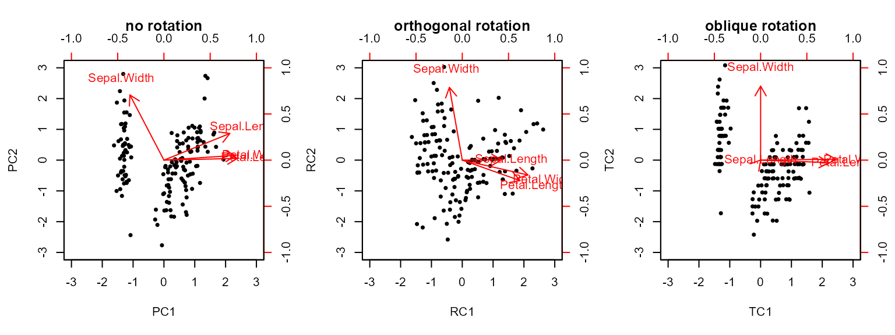

# Extending ordr: PCA

## Introduction

This is the first of 3 vignettes that detail the process of extending
**ordr** to incorporate new ordination methods. The vignettes may be
informative to researchers leveraging geometric data analysis tools
(e.g. psychometric researchers), but the extension process we detail is
intended for software developers with a mathematical or statistical
background. This vignette focuses on principal component analysis, a
straightforward singular value decomposition-based technique, while the
sequel focuses on factor analysis, a much more complicated case. We
demonstrate how to extract key elements from each class based on a
shared underlying mathematical theory and to make these available to
**ordr** using a set of methods based on this theory. We also illustrate
how unit tests and examples are written to complete the contribution.
The final vignette applies both contributions to a common data set to
showcase their commonalities and differences. The vignettes are intended
for R users with experience in geometric data analysis and with the
tidyverse.

If an extension of **ordr** to a new ordination class is agreed upon,
the first step will be to open an issue that includes the checklist from
this developer vignette: `vignette("extension-checklist")`.

``` r
library(ordr)
```

    Warning: package 'ggplot2' was built under R version 4.3.3

``` r
library(psych)
```

### Principal Component Analysis

Principal component analysis (PCA) is a geometric statistical method by
which multivariate data is reduced to fewer dimensions, expending as
little variance as possible in the process—that is, the resulting
dimensions, called *principal axes*, contain as much of the variance as
possible. The goal is to more easily visualize and interpret patterns in
the data. PCA is useful in various fields; this vignette will conclude
with an example using psychometric data.

### EVD and SVD

PCA can be done by applying either of two matrix decomposition methods
to a centered and (often) scaled data matrix ${\bar{X}}_{n \times p}$.

One method, used by
[`stats::prcomp()`](https://rdrr.io/r/stats/prcomp.html), is singular
value decomposition (SVD). Assuming $n > p$, SVD obtains the
decomposition
$${\bar{X}}_{n \times p} = U_{n \times p}D_{p \times p}\left( V_{p \times p} \right)^{\top}\text{,}$$
where the column vectors of $U$ and of $V$ have length $1$ and are
pairwise perpendicular and $D$ is diagonal. The columns of $U$ are
called the *left singular vectors* of $\bar{X}$ and those of $V$ the
*right singular vectors*; the diagonal elements of $D$ are the *singular
values*. Based on the equation, elements from $U$ and from $V$,
respectively, are referred to as “row” and “column” elements.

``` r
scaled_iris <- scale(iris[1:4])
pca_stats <- prcomp(scaled_iris, rank. = 4)
```

The other method uses eigenvalue decomposition (EVD), or just
eigendecomposition, as in
[`stats::princomp()`](https://rdrr.io/r/stats/princomp.html) and in
[`psych::principal()`](https://rdrr.io/pkg/psych/man/principal.html).
The EVD of a full-rank square matrix $M$ is the unique decomposition
$$M = V\Lambda V^{\top}$$ with $\Lambda$ diagonal; the entries of
$\Lambda$ are called the eigenvalues, and the columns of $V$ are called
the eigenvectors, of $M$. For PCA, we obtain $U$ as the matrix of
eigenvectors of $\bar{X}{\bar{X}}^{\top}$ and $V$ as the that of
${\bar{X}}^{\top}\bar{X}$. The positive eigenvalues from these two
decompositions agree, and their square roots are the singular values of
$\bar{X}$. The fold demonstrates these connections between SVD and EVD.

``` r
( pca_psych <- principal(scaled_iris, nfactors = 4, rotate = "none") )
```

    Principal Components Analysis
    Call: principal(r = scaled_iris, nfactors = 4, rotate = "none")
    Standardized loadings (pattern matrix) based upon correlation matrix
                   PC1  PC2   PC3   PC4 h2       u2 com
    Sepal.Length  0.89 0.36 -0.28 -0.04  1  1.1e-16 1.5
    Sepal.Width  -0.46 0.88  0.09  0.02  1  4.4e-16 1.5
    Petal.Length  0.99 0.02  0.05  0.12  1 -4.4e-16 1.0
    Petal.Width   0.96 0.06  0.24 -0.08  1  0.0e+00 1.1

                           PC1  PC2  PC3  PC4
    SS loadings           2.92 0.91 0.15 0.02
    Proportion Var        0.73 0.23 0.04 0.01
    Cumulative Var        0.73 0.96 0.99 1.00
    Proportion Explained  0.73 0.23 0.04 0.01
    Cumulative Proportion 0.73 0.96 0.99 1.00

    Mean item complexity =  1.3
    Test of the hypothesis that 4 components are sufficient.

    The root mean square of the residuals (RMSR) is  0 
     with the empirical chi square  0  with prob <  NA 

    Fit based upon off diagonal values = 1

Derive EVD from SVD

To understand EVD in terms of SVD, again take $X = UDV^{\top}$. Then
when we consider the covariance matrix ${\bar{X}}^{\top}\bar{X}$, we
have

$$\begin{aligned}
{\left( {\bar{X}}_{n \times p} \right)^{\top}{\bar{X}}_{n \times p}} & {= \left( U_{n \times p}D_{p \times p}\left( V_{p \times p} \right)^{\top} \right)^{\top}U_{n \times p}D_{p \times p}\left( V_{p \times p} \right)^{\top}} \\
 & {= \left( \left( V_{p \times p} \right)^{\top} \right)^{\top}D_{p \times p}^{\top}\left( U_{n \times p} \right)^{\top}U_{n \times p}D_{p \times p}\left( V_{p \times p} \right)^{\top}} \\
 & {= V_{p \times p}D_{p \times p}D_{p \times p}\left( V_{p \times p} \right)^{\top}} \\
 & {= V_{p \times p}\left( D_{p \times p} \right)^{2}\left( V_{p \times p} \right)^{\top}.}
\end{aligned}$$

Note: we use the orthogonality of $U$ to obtain (3) as
$U^{\top} = U^{-1}$.

Indeed, the singular values of $\bar{X}$ are the square roots of the
eigenvalues of ${\bar{X}}^{\top}\bar{X}$, meaning $D^{2} = \Lambda$.

In reference to factor analysis, $V$ is often called the loadings
matrix—the columns contain the linear coefficients of the measured
variables as they load onto each principal component—while $U$ contains
the scores. Depending on whether the investigator’s focus is on the
variables or the cases, they may want to study and visualize the
loadings or the scores, respectively. When focusing on the scores, the
row data (the cases) may be studied using *principal coordinates*, the
rows of $UD$, while the column data (the variables) are left in
*standard coordinates*, the rows of $V$. Here, the inertia of $D$ has
been *conferred* onto the left singular vectors, changing the space in
which they are being coordinatized. When focusing instead on the
variables, the inertia will often be conferred onto the right singular
vectors, putting the variables in principal coordinates (the rows of
$VD$) and the cases in standard coordinates (the rows of $U$).

## Recovery Methods

By *recovery methods* or *recoverers* we mean the functions that
retrieve key elements from an ordination object. The essential
recoverers extract the components of the decomposition just discussed,
while others extract supplementary elements and annotations specific to
the technique and its implementation.

While these recovery methods will depend on the GDA technique, the
helper function
[`ordr::as_tbl_ord()`](https://corybrunson.github.io/ordr/reference/tbl_ord.html)
reduces redundancy and expedites debugging, so we give it a method for
the `principal` class:

``` r
as_tbl_ord.principal <- getFromNamespace("as_tbl_ord_default", "ordr")
```

This method draws from the recoverers to produce a `tbl_ord`,
illustrated below with the pre-loaded set of Anderson’s iris data:

``` r
( tbl_ord <- as_tbl_ord(pca_stats) )
```

    # A tbl_ord of class 'prcomp': (150 x 4) x (4 x 4)'
    # 4 coordinates: PC1, PC2, ..., PC4
    # 
    # Rows (principal): [ 150 x 4 | 0 ]
        PC1    PC2     PC3 ... | 
                               | 
    
[38;5;250m1
[39m -
[31m2
[39m
[31m.
[39m
[31m26
[39m -
[31m0
[39m
[31m.
[39m
[31m478
[39m  0.127      | 
    
[38;5;250m2
[39m -
[31m2
[39m
[31m.
[39m
[31m0
[39m
[31m7
[39m  0.672  0.234  ... | 
    
[38;5;250m3
[39m -
[31m2
[39m
[31m.
[39m
[31m36
[39m  0.341 -
[31m0
[39m
[31m.
[39m
[31m0
[39m
[31m44
[4m1
[24m
[39m     | 
    
[38;5;250m4
[39m -
[31m2
[39m
[31m.
[39m
[31m29
[39m  0.595 -
[31m0
[39m
[31m.
[39m
[31m0
[39m
[31m91
[4m0
[24m
[39m     | 
    
[38;5;250m5
[39m -
[31m2
[39m
[31m.
[39m
[31m38
[39m -
[31m0
[39m
[31m.
[39m
[31m645
[39m -
[31m0
[39m
[31m.
[39m
[31m0
[39m
[31m15
[4m7
[24m
[39m     | 

    # 
    # Columns (standard): [ 4 x 4 | 0 ]
         PC1     PC2    PC3 ... | 
                                | 
    
[38;5;250m1
[39m  0.521 -
[31m0
[39m
[31m.
[39m
[31m377
[39m   0.720     | 
    
[38;5;250m2
[39m -
[31m0
[39m
[31m.
[39m
[31m269
[39m -
[31m0
[39m
[31m.
[39m
[31m923
[39m  -
[31m0
[39m
[31m.
[39m
[31m244
[39m ... | 
    
[38;5;250m3
[39m  0.580 -
[31m0
[39m
[31m.
[39m
[31m0
[39m
[31m24
[4m5
[24m
[39m -
[31m0
[39m
[31m.
[39m
[31m142
[39m     | 
    
[38;5;250m4
[39m  0.565 -
[31m0
[39m
[31m.
[39m
[31m0
[39m
[31m66
[4m9
[24m
[39m -
[31m0
[39m
[31m.
[39m
[31m634
[39m     | 

### Row and Column Elements

We will begin by defining the following recoverers for a `principal`
object:

- [`ordr::recover_rows()`](https://corybrunson.github.io/ordr/reference/recoverers.html)
  returns $U$, or more generally $UD^{a}$ for some $a$, which factors in
  from the left.
- [`ordr::recover_cols()`](https://corybrunson.github.io/ordr/reference/recoverers.html)
  returns $V$ or some $VD^{b}$, which factors into the SVD from the
  right.

In an SVD $\bar{X} = UDV^{\top}$, the left and right matrix factors
contain coefficients of the row elements and column elements,
respectively, of the original data $X$ in a new coordinate space. This
is why we refer to elements of the left factor $U$ (or $UD$) as “row
elements” and those of the right factor $V$ (or $VD$) as “column
elements”. With SVD, both factors are said to contain “active” elements.

An EVD-based method might be based on the row inner products $XX^{\top}$
or on the column inner products ${\bar{X}}^{\top}\bar{X}$. Either way,
the EVD yields a symmetric factorization
$V\Lambda V^{\top} = (VD)(VD)^{\top}$; the “left” and “right” factors
are the same. EVD-based PCA uses the latter, a decomposition of the
covariance matrix $X^{\top}X$ (which happily means that the $V$ in this
paragraph is the same as that in the last). We therefore interpret the
loadings $VD$ as active column elements, and we write the column
recovery method to extract this matrix:

``` r
recover_cols.principal <- function(x) {
  unclass(x[["loadings"]])
}
recover_cols.principal(pca_psych)
```

                        PC1        PC2         PC3         PC4
    Sepal.Length  0.8901688 0.36082989 -0.27565767 -0.03760602
    Sepal.Width  -0.4601427 0.88271627  0.09361987  0.01777631
    Petal.Length  0.9915552 0.02341519  0.05444699  0.11534978
    Petal.Width   0.9649790 0.06399985  0.24298265 -0.07535950

We obtain no active row elements from this class, so we write the row
recovery method to return a matrix with no rows (elements) but the
correct number and names of the columns (artificial coordinates):

``` r
recover_rows.principal <- function(x) {
  matrix(
    nrow = 0, ncol = ncol(x[["loadings"]]),
    dimnames = list(NULL, colnames(x[["loadings"]]))
  )
}
recover_rows.principal(pca_psych)
```

         PC1 PC2 PC3 PC4

We do obtain case scores, which are unambiguously row elements; however,
they are not obtained through SVD but computed internally. We can still
verify that they multiply with the loadings to reconstruct $\bar{X}$:

Check that scores and loadings reconstruct data

We divide the scores–loadings product elementwise by the data matrix and
print the first few rows:

``` r
head(
  (pca_psych$scores %*% t(pca_psych$loadings)) / scaled_iris
)
```

         Sepal.Length Sepal.Width Petal.Length Petal.Width
    [1,]            1           1            1           1
    [2,]            1           1            1           1
    [3,]            1           1            1           1
    [4,]            1           1            1           1
    [5,]            1           1            1           1
    [6,]            1           1            1           1

We use element-wise division to show equality rather than
[`all.equal()`](https://rdrr.io/r/base/all.equal.html) or
[`identical()`](https://rdrr.io/r/base/identical.html) because rounding
errors may result in small differences in computation despite
mathematical equivalence. The matrix of all 1s indicates that the
original matrices were equal.

Hence, the scores are supplementary row elements, and we can go ahead
and write a recovery method for them. We must also account for cases
where `scores = FALSE` is passed, resulting in no `scores` element in
the `principal`-class output.

``` r
recover_supp_rows.principal <- function(x) {
  if (is.null(x[["scores"]])) {
    tibble(numeric(0), nrow = 0, ncol = ncol(x[["loadings"]]))
  }
  else {
    x[["scores"]]
  }
}
head(recover_supp_rows.principal(pca_psych))
```

               PC1        PC2         PC3         PC4
    [1,] -1.321232  0.5004175 -0.33224592 -0.16735979
    [2,] -1.214037 -0.7027698 -0.61036929 -0.71330052
    [3,] -1.379296 -0.3564318  0.11499664 -0.19650520
    [4,] -1.341465 -0.6227710  0.23750458  0.45672855
    [5,] -1.394238  0.6743121  0.04094522  0.24875802
    [6,] -1.210927  1.5524358  0.07016197 -0.04576028

### Inertia and its Conference

The next recoverer obtains the inertia, or variance, along each
principal axis:

- [`ordr::recover_inertia()`](https://corybrunson.github.io/ordr/reference/recoverers.html)
  returns the eigenvalues of our EVD, or equivalently the squared
  singular values of our SVD—the diagonal entries of $D^{2}$.

From the documentation,
[`psych::principal()`](https://rdrr.io/pkg/psych/man/principal.html)
returns the eigenvalues in the `values` element of the output:

``` r
pca_psych$values
```

    [1] 2.91849782 0.91403047 0.14675688 0.02071484

We can validate these values against those returned using the recovery
method for the `prcomp` class:

``` r
recover_inertia(pca_stats) / pca_psych$values
```

    [1] 149 149 149 149

Notice that $149 = n - 1$, indicating that these eigenvalues have been
scaled by the degrees of freedom. To obtain the inertia, we need then to
multiply them by $n - 1$:

``` r
recover_inertia.principal <- function(x) {
  x[["values"]] * (nrow(x[["scores"]]) - 1L)
}
recover_inertia.principal(pca_psych)
```

    [1] 434.856175 136.190540  21.866774   3.086511

This method is consistent with that for the `prcomp` class.

These values are usually given the names of the artificial coordinates.
Because these names are used for several other purposes, they have a
separate recovery method:

- [`ordr::recover_coord()`](https://corybrunson.github.io/ordr/reference/recoverers.html)
  returns the names of the coordinate axes of our ordination object.

As with the row element recoverers above, we obtain these names from the
column names of the loading matrix:

``` r
recover_coord.principal <- function(x) {
  colnames(x[["loadings"]])
}
recover_coord.principal(pca_psych)
```

    [1] "PC1" "PC2" "PC3" "PC4"

The inertia is established, but the methods must also account for how it
is conferred on the matrix factors ($a$ and $b$ above), which brings us
to the next recoverer:

- [`ordr::recover_conference()`](https://corybrunson.github.io/ordr/reference/conference.html)
  indicates how the inertia is distributed to the rows or columns ($U$
  or $V$) in the object. (**stats** and **psych** make different choices
  here.)

Implications of different conferences of inertia

The “conference” governs the geometry of biplots and matters crucially
to their interpretation, but the matrix factors returned by different
techniques may confer it differently. To avoid having to manipulate the
matrix factors during recovery, we use the
[`recover_conference()`](https://corybrunson.github.io/ordr/reference/conference.html)
method to inform **ordr** how this conference is done.

Not distributing the inertia (i.e. not multiplying out the matrix $D$ in
SVD or EVD) maintains $U$ and $V$ as matrices of unit vectors. Thus, we
say that the cases and variables are in standard coordinates. But when
we *do* distribute the inertia to one or both other matrices in the
decomposition, we obtain the cases and/or variables in principal
coordinates.

Assuming we desire principal coordinates, EVD-based techniques leave
only the option of conferring inertia onto one matrix of singular
vectors. This depends on the implementation (and how we interpret it),
and in the case of
[`psych::principal()`](https://rdrr.io/pkg/psych/man/principal.html) it
would be the right singular vectors. However, the conference of inertia
in SVD-based techniques depends on the user’s motivation. In short, if
the user wishes to maintain the approximate Euclidean distances between
data cases, then conference onto the left singular vectors is ideal. If
instead the user wishes to maintain the approximate correlations between
variables, then conference onto the right singular vectors is ideal.

``` r
recover_conference(pca_stats)
```

    [1] 1 0

The conference recovery method is, so far, always a static vector, since
the methods don’t confer inertia differently based on the input. Here,
we see that [`stats::prcomp()`](https://rdrr.io/r/stats/prcomp.html)
automatically confers all inertia onto the left singular vectors (a
conference of $(0,1)$, alternatively, would indicate that a PCA has
conferred its inertia onto the right singular vectors). This means that
the scores of `pca_stats` are in principal coordinates and the loadings
are in standard coordinates.

This is straightforward for the loadings: We expect from the EVD that
they are in principal coordinates, i.e. that they have full inertia, and
we checked that the loadings matrix agrees with the full-inertia
loadings obtained from
[`stats::prcomp()`](https://rdrr.io/r/stats/prcomp.html). So, $L = VD$.
We also checked that the product $SL^{\top}$ reconstructs $\bar{X}$,
which suggests that $S = U$. So, the scores should be in standard
coordinates, i.e. they have been conferred no inertia. Symbolically:

$$X = UDV^{\top} = \left( UD^{0} \right)\left( VD^{1} \right)^{\top} = SL^{\top}$$

This yields a conference of $(0,1)$. A careful check follows.

Check that the loadings matrix has full inertia

``` r
# X'X from EVD
cov <- cov(scaled_iris)
evd <- eigen(cov)
# observe loadings matrix equals VD up to sign
( evd$vectors %*% diag(sqrt(evd$values))) / unclass(pca_psych$loadings )
```

                 PC1 PC2 PC3 PC4
    Sepal.Length   1  -1  -1  -1
    Sepal.Width    1  -1  -1  -1
    Petal.Length   1  -1  -1  -1
    Petal.Width    1  -1  -1  -1

Hence we have $L_{p \times p} = V_{p \times p}D_{p \times p}$.

As such, we define the following recovery method:

``` r
recover_conference.principal <- function(x) {
  c(0, 1)
}
recover_conference.principal(pca_psych)
```

    [1] 0 1

### PCA Followed by Rotation

In factor analysis, the loadings—a transformation of the measured or
“manifest” variables into a smaller set of latent variables—will often
be composed with a rotation—a change of basis to a new but same-sized
set of latent variables—to achieve “simple structure” in which the
latent variables are easier to interpret. We’ll discuss this in more
detail in the FA vignette. Because PCA has long been appropriated for
FA, such rotations may also be applied to the results of PCA, and this
functionality is provided by **psych**.

Rotations may be either orthogonal or oblique. We compute and illustrate
both in the next two code chunks, using an oblique rotation provided by
**GPArotation**.

Remark about precision of language

Mathematically, oblique rotations are not proper rotations, which are
angle-preserving. Following the FA literature, we refer to both as
“rotations” but always qualify those that are oblique.

Fundamental to PCA are the orthogonality of the principal components and
the minimality of the residual variance of each principal subspace.
Oblique rotations compromise the former, while even orthogonal rotations
undermine the latter. For these reasons, it is contested whether PCA
with rotation should still be considered PCA. For clarity, we refer to
these models as “PCA *followed by* rotation”.

``` r
library(GPArotation)
```

    Warning: package 'GPArotation' was built under R version 4.3.3

``` r
( pca_ortho <- principal(scaled_iris, rotate = "varimax", nfactors = 4) )
```

    Principal Components Analysis
    Call: principal(r = scaled_iris, nfactors = 4, rotate = "varimax")
    Standardized loadings (pattern matrix) based upon correlation matrix
                   RC1   RC3   RC2   RC4 h2       u2 com
    Sepal.Length  0.53  0.85  0.00  0.00  1  1.1e-16 1.7
    Sepal.Width  -0.17 -0.04  0.98 -0.01  1  4.4e-16 1.1
    Petal.Length  0.78  0.54 -0.28  0.14  1 -4.4e-16 2.2
    Petal.Width   0.89  0.41 -0.20 -0.06  1  0.0e+00 1.5

                           RC1  RC3  RC2  RC4
    SS loadings           1.71 1.18 1.09 0.02
    Proportion Var        0.43 0.30 0.27 0.01
    Cumulative Var        0.43 0.72 0.99 1.00
    Proportion Explained  0.43 0.30 0.27 0.01
    Cumulative Proportion 0.43 0.72 0.99 1.00

    Mean item complexity =  1.6
    Test of the hypothesis that 4 components are sufficient.

    The root mean square of the residuals (RMSR) is  0 
     with the empirical chi square  0  with prob <  NA 

    Fit based upon off diagonal values = 1

``` r
( pca_obliq <- principal(scaled_iris, rotate = "oblimin", nfactors = 4) )
```

    Warning in GPFoblq(A, Tmat = Tmat, normalize = normalize, eps = eps, maxit =
    maxit, : convergence not obtained in GPFoblq. 1000 iterations used.

    Principal Components Analysis
    Call: principal(r = scaled_iris, nfactors = 4, rotate = "oblimin")
    Standardized loadings (pattern matrix) based upon correlation matrix
                  TC1   TC3   TC2   TC4 h2       u2 com
    Sepal.Length 0.00  1.00  0.00 -0.01  1  1.1e-16 1.0
    Sepal.Width  0.00  0.00  1.00  0.01  1  4.4e-16 1.0
    Petal.Length 0.92  0.05 -0.03  0.14  1 -4.4e-16 1.1
    Petal.Width  1.02 -0.01  0.01 -0.11  1  0.0e+00 1.0

                           TC1  TC3  TC2  TC4
    SS loadings           1.92 1.04 1.01 0.03
    Proportion Var        0.48 0.26 0.25 0.01
    Cumulative Var        0.48 0.74 0.99 1.00
    Proportion Explained  0.48 0.26 0.25 0.01
    Cumulative Proportion 0.48 0.74 0.99 1.00

     With component correlations of 
          TC1   TC3   TC2   TC4
    TC1  1.00  0.84 -0.39  0.06
    TC3  0.84  1.00 -0.12  0.26
    TC2 -0.39 -0.12  1.00 -0.19
    TC4  0.06  0.26 -0.19  1.00

    Mean item complexity =  1
    Test of the hypothesis that 4 components are sufficient.

    The root mean square of the residuals (RMSR) is  0 
     with the empirical chi square  0  with prob <  NA 

    Fit based upon off diagonal values = 1

``` r
op <- par(mfrow = c(1, 3))
biplot.psych(pca_psych, choose = c(1, 2), main = "no rotation")
biplot.psych(pca_ortho, choose = c("RC1","RC2"), main = "orthogonal rotation")
biplot.psych(pca_obliq, choose = c("TC1","TC2"), main = "oblique rotation")
```



``` r
par(op)
```

The biplots suggest that the rotations twist the manifest variables
(vectors) to better align with the latent variables (axes); in fact,
they twist the latent variables to better align with the manifest
variables. Because all 4 factors (principal components) were obtained,
the rotations are not constrained to two dimensions, and the geometry of
the vectors in the 2-dimensional projection warps. However, both
rotations preserve the correlations between the manifest variables in
the transformed space. (The angles between vectors appear to change
dramatically under the oblique rotation, but recall that the rotated
principal axes are no longer orthogonal; the biplots do not communicate
this and even obscure it.)

Check and interpret rotated loadings

This extended fold examines the linear algebra at play in each rotation.
In PCA followed by an orthogonal rotation, the rotated loadings are the
original loadings matrix $L_{p \times p}$ multiplied by the orthogonal
rotation matrix $T_{p \times p}$:

``` r
pca_ortho$loadings[, c("RC1", "RC2", "RC3", "RC4")] /
  (pca_psych$loadings %*% pca_ortho$rot.mat)
```

                 RC1 RC2 RC3 RC4
    Sepal.Length   1   1  -1   1
    Sepal.Width    1   1  -1   1
    Petal.Length   1   1  -1   1
    Petal.Width    1   1  -1   1

In the oblique case, we obtain two loading matrices. The first is the
*pattern matrix* $L_{p \times p}T_{p \times p}$. The `$loadings` element
extractable from an oblique-transformed `principal` object is the
pattern matrix:

``` r
pca_obliq$loadings[, c("TC1", "TC2", "TC3", "TC4")] /
  (pca_psych$loadings %*% pca_obliq$rot.mat)
```

                 TC1 TC2 TC3 TC4
    Sepal.Length   1   1  -1   1
    Sepal.Width    1   1  -1   1
    Petal.Length   1   1  -1   1
    Petal.Width    1   1  -1   1

The pattern matrix quantifies how much each principal component loads
into each variable.

The second loadings object is the *structure matrix*
$S_{p \times p} = L_{p \times p}T_{p \times p}\Phi_{p \times p}$. The
structure matrix is obtained from the pattern matrix via multiplying by
the interfactor correlation matrix $\Phi_{p \times p}$.

``` r
(pca_obliq$loadings %*% pca_obliq$Phi) /
  pca_obliq$Structure
```

                 TC1 TC3 TC2 TC4
    Sepal.Length   1   1   1   1
    Sepal.Width    1   1   1   1
    Petal.Length   1   1   1   1
    Petal.Width    1   1   1   1

The structure matrix contains correlations between factors and
variables, and it tends to be more stable between samples.

In the orthogonal case, $\Phi_{p \times p}$ is the identity matrix,
which is why we have just one loadings matrix. Accordingly, a
`principal` object only contains `$Structure` and `$Phi` elements if it
contains an oblique rotation.

The choice between an orthogonal and oblique rotation depends on our
priorities. An orthogonal rotation keeps the model more faithful to the
data. But if we want to convey significant correlation in the variables
or to more easily interpret a biplot, then an oblique rotation may be
more appropriate. Various different rotations suitable for different
goals exist within either category.

One way **ordr** might organize this information would be to separately
recover the unrotated loadings and the rotation matrix. This would
require some transformation, since the `principal` class stores the
already-rotated loadings, but it might be worth the trouble to
disentangle other aspects of the class and to generalize the recovery
process to more methods. On the other hand, it might be misguided to
recover the rotation matrix as an element, as it would enable
questionable practices like overlaying un-rotated loadings with scores
based on the rotated loadings. For now, **ordr** recovers elements for
the rotated model:

``` r
recover_cols.principal(pca_obliq)
```

                         TC1         TC3         TC2          TC4
    Sepal.Length 0.001135748  1.00104339  0.00135006 -0.007037052
    Sepal.Width  0.000138637  0.00150469  1.00121836  0.005252757
    Petal.Length 0.921306788  0.05149774 -0.03318141  0.143665190
    Petal.Width  1.016481008 -0.01298686  0.01299764 -0.105507227

``` r
recover_cols.principal(pca_ortho)
```

                        RC1         RC3         RC2          RC4
    Sepal.Length  0.5307647  0.84749442  0.00480238 -0.004354515
    Sepal.Width  -0.1734876 -0.03569366  0.98415576 -0.008089084
    Petal.Length  0.7806361  0.54202999 -0.27690180  0.141902059
    Petal.Width   0.8878262  0.40995148 -0.20111456 -0.057072742

Either way, the methods must be informed by the additional caution and
checks above.

### Augmentation

We have recovered all of the **ordr**-relevant geometric data from the
`principal` object. What remains are any pieces of information in the
class that annotate the matrix factors:

- [`ordr::recover_aug_rows()`](https://corybrunson.github.io/ordr/reference/augmentation.html)
  and
  [`ordr::recover_aug_cols()`](https://corybrunson.github.io/ordr/reference/augmentation.html)
  do not recover raw elements of the PCA but rather reassemble
  additional, often non-numeric elements that augment the row and column
  coordinates.

This information is organized in each case as a tibble, not a matrix.
For convenience, we attach the **tibble** package:

``` r
library(tibble)
```

The most important annotations are the names, which will usually have
been taken from the row and column names of the data set $\bar{X}$. But
they may also include information specific to these units (cases and
variables for PCA) that was carried over from the data object, e.g. the
`Species` column from the `iris` data, or that governed pre-processing,
e.g. the variable means and standard deviations when variables are
scaled before PCA.

The row and column augmentation recoverers must also comport with the
active and any supplementary elements recovered by those methods. For
example, our row augmentation function must recognize that no active row
elements are recovered and that the supplementary elements, if available
for recovery, correspond to the cases:

``` r
recover_aug_rows.principal <- function(x) {
  # no active elements
  res <- tibble(.rows = 0L)
  
  # scores as supplementary elements
  if (!is.null(x[["scores"]])) {
    name <- rownames(x[["scores"]])
    res_sup <- if (is.null(name)) {
      tibble(.rows = nrow(x[["scores"]]))
    } else {
      tibble(name = name)
    }
  } else {
    res_sup <- tibble(.rows = 0L)
  }
  
  # supplement flag
  res$.element <- "active"
  res_sup$.element <- "score"
  as_tibble(dplyr::bind_rows(res, res_sup))
}
```

Our column augmentation function concerns only active elements. In
addition to the variable names, we augment the column elements with the
means and standard deviations obtained during pre-processing and
included in the `principal` object:

``` r
recover_aug_cols.principal <- function(x) {
  name <- rownames(x[["loadings"]])
  res <- if (is.null(name)) {
    tibble(.rows = nrow(x[["loadings"]]))
  } else {
    tibble(name = name)
  }
  res$.element <- "active"
  res
}
```

These values are required for some biplot layers like calibrated axes.

Finally, the coordinate augmentation function provides the coordinate
names and their standard deviations, which are provided in the
`principal` object:

``` r
recover_aug_coord.principal <- function(x) {
  data.frame(
    name = recover_coord.principal(x),
    sdev = sqrt(x[["values"]][seq(1, ncol(x[["loadings"]]))])
  )
}
```

Check numbers of rows

To preempt bugs, we should ensure that the number of rows in each
augmented data frame agree with those of the corresponding extracted
matrix.

``` r
nrow(recover_aug_rows.principal(pca_psych)) ==
  nrow(recover_rows.principal(pca_psych)) +
  nrow(recover_supp_rows.principal(pca_psych))
```

    [1] TRUE

``` r
nrow(recover_aug_cols.principal(pca_psych)) ==
  nrow(recover_cols.principal(pca_psych))
```

    [1] TRUE

``` r
nrow(recover_aug_coord.principal(pca_psych)) ==
  length(recover_inertia(pca_psych))
```

    [1] TRUE

We have now defined the methods required to obtain the `tbl_ord` wrapper
for a `principal` object:

``` r
pca_psych |> 
  as_tbl_ord() |>
  augment_ord()
```

    # A tbl_ord of class 'psych': (150 x 4) x (4 x 4)'
    # 4 coordinates: PC1, PC2, ..., PC4
    # 
    # Rows (standard): [ 150 x 4 | 1 ]
        PC1    PC2     PC3 ... |   .element
                               |   
[3m
[38;5;246m<chr>
[39m
[23m   
    
[38;5;250m1
[39m -
[31m1
[39m
[31m.
[39m
[31m32
[39m  0.500 -
[31m0
[39m
[31m.
[39m
[31m332
[39m      | 
[38;5;250m1
[39m score   
    
[38;5;250m2
[39m -
[31m1
[39m
[31m.
[39m
[31m21
[39m -
[31m0
[39m
[31m.
[39m
[31m703
[39m -
[31m0
[39m
[31m.
[39m
[31m610
[39m  ... | 
[38;5;250m2
[39m score   
    
[38;5;250m3
[39m -
[31m1
[39m
[31m.
[39m
[31m38
[39m -
[31m0
[39m
[31m.
[39m
[31m356
[39m  0.115      | 
[38;5;250m3
[39m score   
    
[38;5;250m4
[39m -
[31m1
[39m
[31m.
[39m
[31m34
[39m -
[31m0
[39m
[31m.
[39m
[31m623
[39m  0.238      | 
[38;5;250m4
[39m score   
    
[38;5;250m5
[39m -
[31m1
[39m
[31m.
[39m
[31m39
[39m  0.674  0.040
[4m9
[24m     | 
[38;5;250m5
[39m score   
    
[38;5;246m# ℹ 145 more rows
[39m
    # 
    # Columns (principal): [ 4 x 4 | 2 ]
         PC1    PC2     PC3 ... |   name         .element
                                |   
[3m
[38;5;246m<chr>
[39m
[23m        
[3m
[38;5;246m<chr>
[39m
[23m   
    
[38;5;250m1
[39m  0.890 0.361  -
[31m0
[39m
[31m.
[39m
[31m276
[39m      | 
[38;5;250m1
[39m Sepal.Length active  
    
[38;5;250m2
[39m -
[31m0
[39m
[31m.
[39m
[31m460
[39m 0.883   0.093
[4m6
[24m ... | 
[38;5;250m2
[39m Sepal.Width  active  
    
[38;5;250m3
[39m  0.992 0.023
[4m4
[24m  0.054
[4m4
[24m     | 
[38;5;250m3
[39m Petal.Length active  
    
[38;5;250m4
[39m  0.965 0.064
[4m0
[24m  0.243      | 
[38;5;250m4
[39m Petal.Width  active  

This can also now be done “under the hood” by
[`ordinate()`](https://corybrunson.github.io/ordr/reference/ordinate.html):

``` r
ordinate(scaled_iris, ~ principal(., nfactors = 4, rotate = "none"))
```

    # A tbl_ord of class 'psych': (150 x 4) x (4 x 4)'
    # 4 coordinates: PC1, PC2, ..., PC4
    # 
    # Rows (standard): [ 150 x 4 | 1 ]
        PC1    PC2     PC3 ... |   .element
                               |   
[3m
[38;5;246m<chr>
[39m
[23m   
    
[38;5;250m1
[39m -
[31m1
[39m
[31m.
[39m
[31m32
[39m  0.500 -
[31m0
[39m
[31m.
[39m
[31m332
[39m      | 
[38;5;250m1
[39m score   
    
[38;5;250m2
[39m -
[31m1
[39m
[31m.
[39m
[31m21
[39m -
[31m0
[39m
[31m.
[39m
[31m703
[39m -
[31m0
[39m
[31m.
[39m
[31m610
[39m  ... | 
[38;5;250m2
[39m score   
    
[38;5;250m3
[39m -
[31m1
[39m
[31m.
[39m
[31m38
[39m -
[31m0
[39m
[31m.
[39m
[31m356
[39m  0.115      | 
[38;5;250m3
[39m score   
    
[38;5;250m4
[39m -
[31m1
[39m
[31m.
[39m
[31m34
[39m -
[31m0
[39m
[31m.
[39m
[31m623
[39m  0.238      | 
[38;5;250m4
[39m score   
    
[38;5;250m5
[39m -
[31m1
[39m
[31m.
[39m
[31m39
[39m  0.674  0.040
[4m9
[24m     | 
[38;5;250m5
[39m score   
    
[38;5;246m# ℹ 145 more rows
[39m
    # 
    # Columns (principal): [ 4 x 4 | 2 ]
         PC1    PC2     PC3 ... |   name         .element
                                |   
[3m
[38;5;246m<chr>
[39m
[23m        
[3m
[38;5;246m<chr>
[39m
[23m   
    
[38;5;250m1
[39m  0.890 0.361  -
[31m0
[39m
[31m.
[39m
[31m276
[39m      | 
[38;5;250m1
[39m Sepal.Length active  
    
[38;5;250m2
[39m -
[31m0
[39m
[31m.
[39m
[31m460
[39m 0.883   0.093
[4m6
[24m ... | 
[38;5;250m2
[39m Sepal.Width  active  
    
[38;5;250m3
[39m  0.992 0.023
[4m4
[24m  0.054
[4m4
[24m     | 
[38;5;250m3
[39m Petal.Length active  
    
[38;5;250m4
[39m  0.965 0.064
[4m0
[24m  0.243      | 
[38;5;250m4
[39m Petal.Width  active  

## Package Infrastructure

With the recovery methods written and checked, we round out our
contribution with unit tests, examples, and written documentation.

### Unit Tests

First, we draw from our lessons above to write a script of unit tests
for these recoverers. We locate the script in `tests/testthat/` and name
it following the pattern `test-<package>-<class>.r`. To demonstrate that
our methods pass the tests, we attach the **testthat** package:

``` r
library(testthat)
```

    Warning: package 'testthat' was built under R version 4.3.3

    Attaching package: 'testthat'

    The following object is masked from 'package:psych':

        describe

We write the following tests, which will only be run if **psych** is
installed:

``` r
skip_if_not_installed("psych")

fit_principal <- psych::principal(iris[, -5], nfactors = 4, rotate = "none")

test_that("'principal' accessors have consistent dimensions", {
  expect_equal(ncol(get_rows(fit_principal)), ncol(get_cols(fit_principal)))
  expect_equal(ncol(get_rows(fit_principal)),
               length(recover_inertia(fit_principal)))
})
```

    
[32mTest passed
[39m 🥇

``` r
test_that("'principal' has specified distribution of inertia", {
  expect_type(recover_conference(fit_principal), "double")
  expect_vector(recover_conference(fit_principal), size = 2L)
})
```

    
[32mTest passed
[39m 🎊

``` r
test_that("'principal' augmentations are consistent with '.element' column", {
  expect_equal(".element" %in% names(recover_aug_rows(fit_principal)),
               ".element" %in% names(recover_aug_cols(fit_principal)))
})
```

    
[32mTest passed
[39m 🌈

``` r
test_that("`as_tbl_ord()` coerces 'principal' objects", {
  expect_true(valid_tbl_ord(as_tbl_ord(fit_principal)))
})
```

    
[32mTest passed
[39m 🎊

### Examples

We next adapt an examples script from those for other methods, but
reflecting some of the special cases we encountered above. The file name
`ex-methods-psych-principal-iris.r` follows a similar convention but
with the illustrative data set specified (allowing for more than one
script if helpful), and the script also begins by conditioning itself on
**psych** being installed:

``` r
if (require(psych)) {# {psych}

# data frame of Anderson iris species measurements
class(iris)
head(iris)

# compute unscaled row-principal components of scaled measurements
iris[, -5] |>
  psych::principal(nfactors = 4, rotate = "none") |>
  as_tbl_ord() |>
  print() -> iris_pca

# compute varimax-rotated row-principal components of scaled measurements
iris[, -5] |>
  psych::principal(nfactors = 4, rotate = "varimax") |>
  as_tbl_ord() |>
  print() -> iris_pca_varimax

# recover observation principal coordinates
head(get_rows(iris_pca))

# recover rotated loadings
get_cols(iris_pca_varimax)

# augment measurement coordinates with names and scaling parameters
( iris_pca <- augment_ord(iris_pca) )
( iris_pca_varimax <- augment_ord(iris_pca_varimax) )

}# {psych}
```

### Documentation

Finally, we collect and document the recoverers in a file named
`methods-psych-principal.r`, following the pattern
`methods-<package>-<class>.r`:

``` r
#' @title Functionality for principal components analysis ('principal') objects
#'
#' @description These methods extract data from, and attribute new data to,
#'   objects of class `"principal"` as returned by [psych::principal()].
#'
#'@details
#' 
#' <truncated>
#'
#' @name methods-principal
#' @author John Gracey
#' @template param-methods
#' @template return-methods
#' @family methods for eigen-decomposition-based techniques
#' @family models from the psych package
#' @example inst/examples/ex-methods-psych-principal-iris.R
NULL
```

The remainder of the file defines each recovery method, in each case
preceded by tags that anchor it to the manual entry `methods-principal`
and export it to the user. Note that the **roxygen2** tag `@family`
cross-links this entry with related entries (EVD-powered and from the
same package), while the tag `@example` calls the installed example
script to include its code in the “Examples” section of the entry.

### Submission

The function
[`devtools::check()`](https://devtools.r-lib.org/reference/check.html)
is useful for verifying that the contribution will not generate errors
or warnings, many of which won’t show up when experimenting with code on
the command line or an IDE like RStudio. It also first runs
[`devtools::document()`](https://devtools.r-lib.org/reference/document.html)
to “roxygenize” the documentation into an entry stored in the `man/`
folder and incorporated into the package manual. Once the extension has
been formatted and checked, the last steps are to edit `DESCRIPTION`
accordingly, to write an entry in `NEWS.md` and to submit a pull request
following the guidelines of `CONTRIBUTING.md`.
