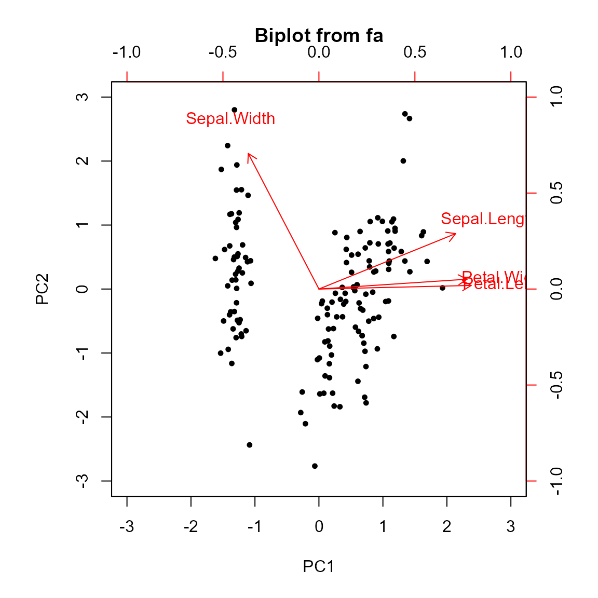
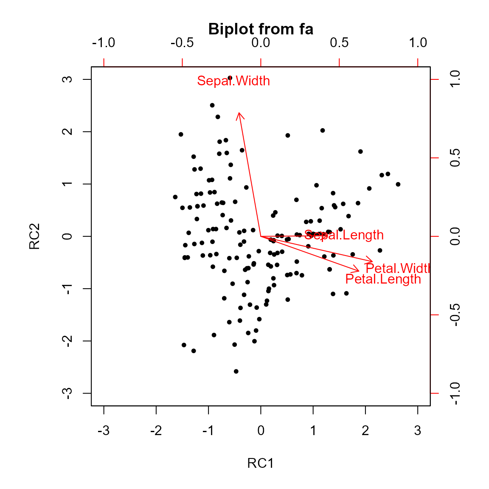
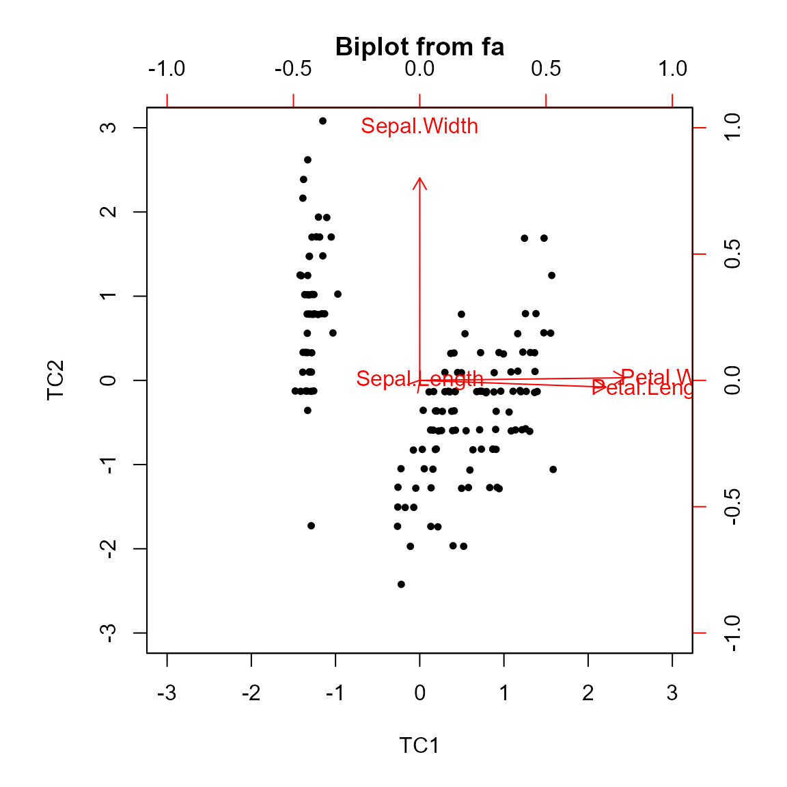
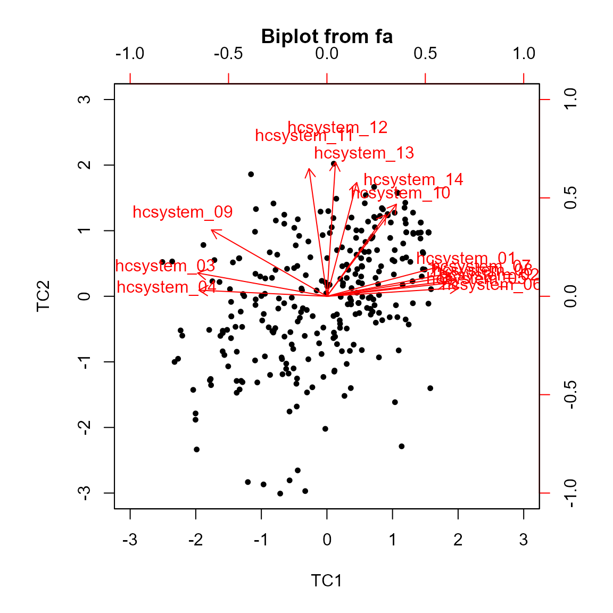
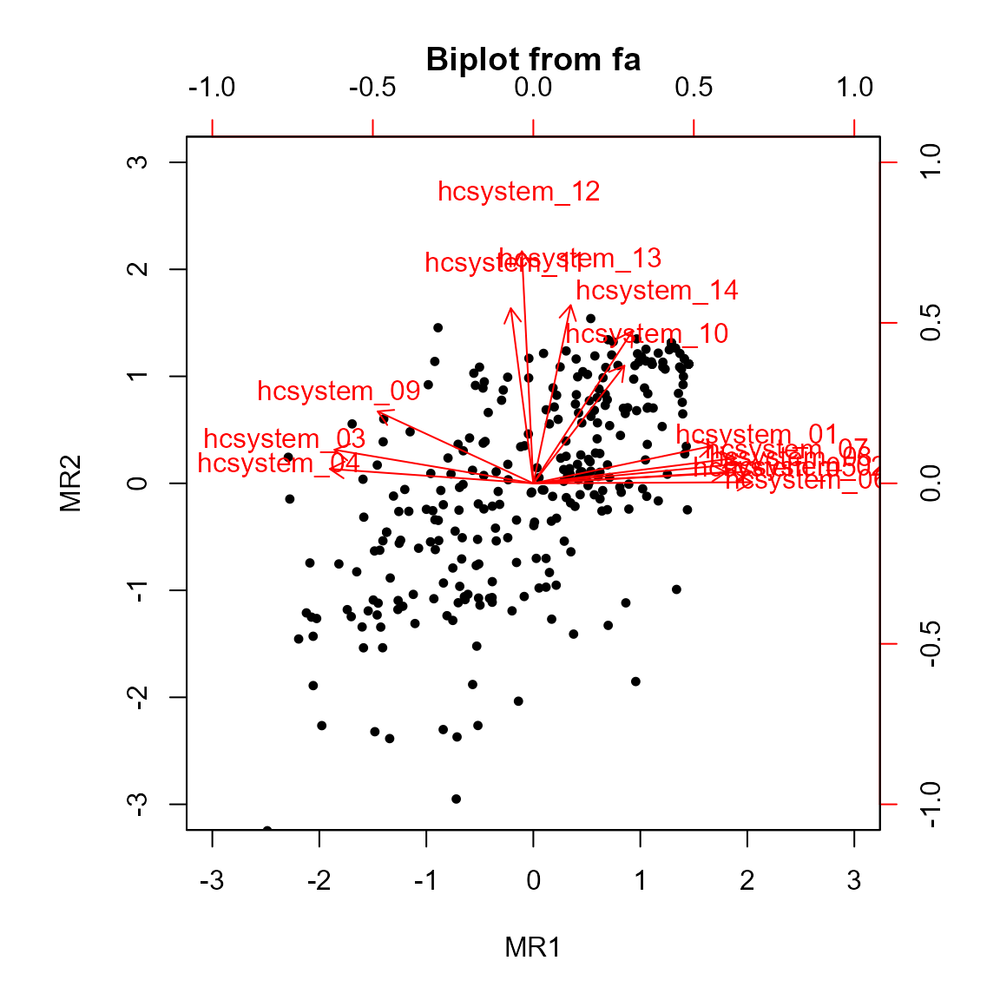

# Writing Recovery Methods for New Ordination Classes

## Introduction

In this vignette intended for R users with experience in geometric data
analysis and knowledge of the intrinsic mathematical theory, we outline
the process of extending **ordr** to incorporate new ordination methods.
To this end, we discuss two ordination techniques–principal component
analysis and factor analysis–and demonstrate how to reflect each
technique’s underlying mathematical theory as we integrate their R
implementations into **ordr**.

In addition to showing how ordination elements are extracted and
recompiled for the `tbl_ord` end product, we illustrate how unit tests
and examples are written to complete a contribution. Finally, we apply
both of our example contributions to the package on a single data set to
illustrate the theoretical unity between ordination methods that
**ordr** seeks to convey.

## Principal Component Analysis

Principal component analysis (PCA) is a geometric statistical method by
which multivariate data is reduced to have fewer dimensions, expending
as little variance as possible in the process. The goal is to more
easily visualize and interpret patterns in a data set. PCA is useful in
various fields of research; as an example later in the vignette, we will
demonstrate how a 14-variable psychometric data set can be accurately
intrepreted on just two axes using PCA.

PCA takes loadings of the variables that capture maximal variance. The
resulting principal components correspond to new, *orthogonal* axes on
which we can represent our data.

#### Recovery for PCA Methods

#### EVD and SVD

We begin by distinguishing two methods of decomposition for PCA, both of
which decompose the centered and scaled data matrix
${\bar{X}}_{n \times p}$.

The first method of decomposition is singular value decomposition (SVD),
used in such PCA functions as
[`stats::prcomp()`](https://rdrr.io/r/stats/prcomp.html) in R. In SVD,
we denote the matrix of normalized eigenvectors of
$\bar{X}{\bar{X}}^{\top}$ as $U$ and refer to $U$ as the *left singular
vectors*. On the other hand, $V$ is the matrix of normalized
eigenvectors of ${\bar{X}}^{\top}\bar{X}$, called the *right singular
vectors*. In either matrix, the columns are the eigenvectors. We refer
to the square roots of the positive eigenvalues corresponding to $U$ and
$V$ as *singular values*. The diagonal matrix $D$ comprises the singular
values in descending order. With these three matrices defined, the final
decomposition becomes
$${\bar{X}}_{n \times p} = U_{n \times p}D_{p \times p}\left( V_{p \times p} \right)^{\top}.$$

Drawing upon this equation and the indices of $U$ and $V$ that multiply
into the decomposition, we may refer to $U$ and $V$ as our “rows” and
“columns,” respectively, in our recovery code.

The second method is eigenvalue decomposition (EVD) or
eigendecomposition, used in
[`stats::princomp()`](https://rdrr.io/r/stats/princomp.html) and
[`psych::principal()`](https://rdrr.io/pkg/psych/man/principal.html). In
EVD, we do not decompose $X$ itself but its covariance matrix
\$X^\topX\$. To understand EVD in terms of SVD, again take
$X = UDV^{\top}$. Then when we consider the covariance matrix, we have
\$\$ \begin{align\*} (\bar{X}\_{n\times{p}})^\top\bar{X}\_{n\times{p}}
&=
(U\_{n\times{p}}D\_{p\times{p}}(V\_{p\times{p}})^\top)^\topU\_{n\times{p}}D\_{p\times{p}}(V\_{p\times{p}})^\top
\tag{1}\\ &=
((V\_{p\times{p}})^\top)^\topD\_{p\times{p}}^\top(U\_{n\times{p}})^\topU\_{n\times{p}}D\_{p\times{p}}(V\_{p\times{p}})^\top
\tag{2}\\ &=
V\_{p\times{p}}D\_{p\times{p}}D\_{p\times{p}}(V\_{p\times{p}})^\top
\tag{3}\\ &= V\_{p\times{p}}(D\_{p\times{p}})^2(V\_{p\times{p}})^\top
\tag{4}. \end{align\*} \$\$

Note: we use the orthogonality of $U$ to obtain (3) as
$U^{\top} = U^{-1}$.

In either decomposition, $V$ is the loadings matrix. The columns contain
the linear combinations of variables that load on each principal
component. In SVD, $U$ is used to find the scores; in EVD, $\bar{X}$
must be multiplied into the decomposition to obtain scores, demonstrated
later.

#### Necessary Recovery Methods

*Recovery methods* or *recoverers* refer to functions that retrieve
isolated elements of an ordination object. Now that we have discussed
the decompositions that serve as foundation for PCA (and later in the
vignette, FA), we can frame the recovery methods behind **ordr**.

1.  [`ordr::recover_inertia()`](https://corybrunson.github.io/ordr/reference/recoverers.html),
    which should return the eigenvalues of our EVD or the squared
    singular values of our SVD; that is, we should obtain the diagonal
    entries of $D^{2}$.
2.  [`ordr::recover_conference()`](https://corybrunson.github.io/ordr/reference/conference.html),
    which should indicate whether the inertia we found is distributed to
    the observations or variables (or, potentially, both or neither).
3.  [`ordr::recover_cols()`](https://corybrunson.github.io/ordr/reference/recoverers.html),
    which should return the matrix whose columns multiply into the
    corresponding decomposition.
4.  [`ordr::recover_supp_cols()`](https://corybrunson.github.io/ordr/reference/supplementation.html),
    which, if appropriate or necessary, should return a column element
    that is obtained by multiplying some matrix through the
    decomposition.
5.  [`ordr::recover_rows()`](https://corybrunson.github.io/ordr/reference/recoverers.html),
    which should return the matrix whose rows multiply into the
    corresponding decomposition.
6.  [`ordr::recover_supp_rows()`](https://corybrunson.github.io/ordr/reference/supplementation.html),
    which, if appropriate or necessary, should return a row element that
    is obtained by multiplying some matrix through the decomposition.
7.  [`ordr::recover_coord()`](https://corybrunson.github.io/ordr/reference/recoverers.html),
    which should return the coordinate names of our ordination object.
8.  [`ordr::recover_aug_rows()`](https://corybrunson.github.io/ordr/reference/augmentation.html)
    and (9)
    [`ordr::recover_aug_cols()`](https://corybrunson.github.io/ordr/reference/augmentation.html),
    which do not recover raw elements of the PCA but rather reassemble
    previously recovered elements for the function
    [`ordr::augment_ord()`](https://corybrunson.github.io/ordr/reference/augmentation.html).

While these recovery methods will be defined based on the GDA technique
and theory at hand, we define the function
[`as_tbl_ord()`](https://corybrunson.github.io/ordr/reference/tbl_ord.html)
uniformly as the below helper function from **ordr** defined to reduce
redundancy and expedite debugging.

``` r
as_tbl_ord.principal <- getFromNamespace("as_tbl_ord_default", "ordr")
```

These recoverers are all necessary to produce a `tbl_ord`, illustrated
below with the pre-loaded set of Anderson’s Iris data.

``` r
library(ordr) # load {ordr} to create `tbl_ord` below
```

    Loading required package: ggplot2

    Warning: package 'ggplot2' was built under R version 4.3.3

``` r
scaled_iris <- scale(iris[1:4])
pca_stats <- prcomp(scaled_iris, rank. = 4)
(tbl_ord <- as_tbl_ord(pca_stats))
```

    # A tbl_ord of class 'prcomp': (150 x 4) x (4 x 4)'
    # 4 coordinates: PC1, PC2, ..., PC4
    # 
    # Rows (principal): [ 150 x 4 | 0 ]
        PC1    PC2     PC3 ... | 
                               | 
    
[38;5;250m1
[39m -
[31m2
[39m
[31m.
[39m
[31m26
[39m -
[31m0
[39m
[31m.
[39m
[31m478
[39m  0.127      | 
    
[38;5;250m2
[39m -
[31m2
[39m
[31m.
[39m
[31m0
[39m
[31m7
[39m  0.672  0.234  ... | 
    
[38;5;250m3
[39m -
[31m2
[39m
[31m.
[39m
[31m36
[39m  0.341 -
[31m0
[39m
[31m.
[39m
[31m0
[39m
[31m44
[4m1
[24m
[39m     | 
    
[38;5;250m4
[39m -
[31m2
[39m
[31m.
[39m
[31m29
[39m  0.595 -
[31m0
[39m
[31m.
[39m
[31m0
[39m
[31m91
[4m0
[24m
[39m     | 
    
[38;5;250m5
[39m -
[31m2
[39m
[31m.
[39m
[31m38
[39m -
[31m0
[39m
[31m.
[39m
[31m645
[39m -
[31m0
[39m
[31m.
[39m
[31m0
[39m
[31m15
[4m7
[24m
[39m     | 

    # 
    # Columns (standard): [ 4 x 4 | 0 ]
         PC1     PC2    PC3 ... | 
                                | 
    
[38;5;250m1
[39m  0.521 -
[31m0
[39m
[31m.
[39m
[31m377
[39m   0.720     | 
    
[38;5;250m2
[39m -
[31m0
[39m
[31m.
[39m
[31m269
[39m -
[31m0
[39m
[31m.
[39m
[31m923
[39m  -
[31m0
[39m
[31m.
[39m
[31m244
[39m ... | 
    
[38;5;250m3
[39m  0.580 -
[31m0
[39m
[31m.
[39m
[31m0
[39m
[31m24
[4m5
[24m
[39m -
[31m0
[39m
[31m.
[39m
[31m142
[39m     | 
    
[38;5;250m4
[39m  0.565 -
[31m0
[39m
[31m.
[39m
[31m0
[39m
[31m66
[4m9
[24m
[39m -
[31m0
[39m
[31m.
[39m
[31m634
[39m     | 

#### Conference of Inertia

The conference of inertia determines how the variance of our data is
distributed. This will take effect in the geometry of PCA biplots. And
because this conference directly impacts the row and column elements
that we will need to recover, we ought to recover conference of inertia
early on.

To this end, let us first recover the inertia itself, using the recovery
method for [`stats::prcomp()`](https://rdrr.io/r/stats/prcomp.html) as a
benchmark against the `values` element of an analogous `principal`
object (which is simply the eigenvalues of the input covariance matrix).

``` r
library(psych) # load {psych} for use of PCA function below
```

    Attaching package: 'psych'

    The following objects are masked from 'package:ggplot2':

        %+%, alpha

``` r
pca_psych <- principal(scaled_iris, nfactors = 4, rotate = "none") # conduct PCA on the same X
recover_inertia(pca_stats) / pca_psych$values
```

    [1] 149 149 149 149

Notice that $149 = n - 1.$ So, to obtain the inertia from a “principal”
object, we need only to multiply the `values` element by $n - 1$. Thus
we define
[`recover_inertia.principal()`](../reference/methods-principal.md) as
follows.

``` r
recover_inertia.principal <- function(x) {
  x[["values"]] * (nrow(x[["scores"]]) - 1)
}

recover_inertia.principal(pca_psych)
```

    [1] 434.856175 136.190540  21.866774   3.086511

Now, our inertia is consistent with that recovered from the `prcomp`
object.

With the inertia established, next we consider how it is conferred. Not
distributing the inertia (i.e. not multiplying out the matrix $D$ in SVD
or EVD) maintains $U$ and $V$ as matrices of unit vectors. Thus, we say
that the cases and variables are in standard coordinates. But when we
*do* distribute the inertia to one or both other matrices in the
decomposition, we obtain the cases and/or variables in principal
coordinates.

Assuming we do wish to have principal coordinates, EVD-based techniques
leave only the option of conferring inertia onto one matrix of singular
vectors. This depends on the implementation (and how we interpret it),
and in the case of
[`psych::principal()`](https://rdrr.io/pkg/psych/man/principal.html) it
would be the right singular vectors. However, the conference of inertia
in SVD-based techniques depends on the user’s motivation. In short, if
the user wishes to maintain the approximate Euclidean distances between
data cases, then conference onto the left singular vectors is ideal. If
instead the user wishes to maintain the approximate correlations between
variables, then conference onto the right singular vectors is ideal.

``` r
recover_conference(pca_stats)
```

    [1] 1 0

The conference recovery method is, so far, always a static vector, since
the methods don’t confer inertia differently based on the input. Here,
we see that [`stats::prcomp()`](https://rdrr.io/r/stats/prcomp.html)
automatically confers all inertia onto the left singular vectors (a
conference of $(0,1)$, alternatively, would indicate that a PCA has
conferred its inertia onto the right singular vectors). This means that
the scores of `pca_stats` are in principal coordinates and the loadings
are in standard coordinates.

When we recover the conference of inertia in
[`psych::principal()`](https://rdrr.io/pkg/psych/man/principal.html), we
would expect a $(0,1)$ conference given that
[`psych::principal()`](https://rdrr.io/pkg/psych/man/principal.html) is
built around EVD (i.e. there are no rows $U$ to confer onto, only the
columns $V^{\top}$). We can check this expectation as follows:

``` r
cov <- cov(scaled_iris) # X*X from EVD
evd <- eigen(cov)
(evd$vectors %*% diag(sqrt(evd$values))) / unclass(pca_psych$loadings) # observe loadings are equal to VD up to sign
```

                 PC1 PC2 PC3 PC4
    Sepal.Length   1  -1  -1  -1
    Sepal.Width    1  -1  -1  -1
    Petal.Length   1  -1  -1  -1
    Petal.Width    1  -1  -1  -1

Note that we use elementwise division to show equality rather than
[`all.equal()`](https://rdrr.io/r/base/all.equal.html) or
[`identical()`](https://rdrr.io/r/base/identical.html) because rounding
errors may result in small differences in computation despite
mathematical equivalence.

Hence, we have $L_{p \times p} = V_{p \times p}D_{p \times p}$, where
$L$ denotes the loadings matrix. Since $L$ will be the matrix we recover
for the right factor, this implies a $(0,1)$ conference. As such, we
define the following recovery method.

``` r
recover_conference.principal <- function(x) {
  c(0, 1)
}

recover_conference.principal(pca_psych)
```

    [1] 0 1

To illustrate the entire decomposition, we have the following code.

``` r
cov / (evd$vectors %*% diag(evd$values) %*% t(evd$vectors))
```

                 Sepal.Length Sepal.Width Petal.Length Petal.Width
    Sepal.Length            1           1            1           1
    Sepal.Width             1           1            1           1
    Petal.Length            1           1            1           1
    Petal.Width             1           1            1           1

As indicated by the matrix of all $1$s, the covariance matrix and
product of matrices are equal.

#### Row and Column Elements

As mentioned in the context of SVD, we can classify elements of PCA by
what they “contribute” to the decomposition. That is, we can refer to
those elements whose rows \[columns\] are multiplied into the
decomposition as “row elements” \[“column elements”\]. Then when we
consider EVD-based PCA, recall that EVD acts on the covariance matrix
\$X^\topX\$, the column-wise inner product. Thus the loadings, $VD$, are
active column elements.

``` r
recover_cols.principal <- function(x) {
  unclass(x[["loadings"]])
}

recover_cols.principal(pca_psych)
```

                        PC1        PC2         PC3         PC4
    Sepal.Length  0.8901688 0.36082989 -0.27565767 -0.03760602
    Sepal.Width  -0.4601427 0.88271627  0.09361987  0.01777631
    Petal.Length  0.9915552 0.02341519  0.05444699  0.11534978
    Petal.Width   0.9649790 0.06399985  0.24298265 -0.07535950

But since we are drawing upon a column-wise inner product, we do not
have an active row element in our PCA. Instead, we treat the scores as
*supplementary* elements. In EVD-based methods like
[`psych::principal()`](https://rdrr.io/pkg/psych/man/principal.html), we
can still obtain $X$ by multiplying the rows of scores by transposed
loadings with full inertia.

``` r
head((pca_psych$scores %*% t(pca_psych$loadings)) / scaled_iris) # matrix of all 1s indicates equality
```

         Sepal.Length Sepal.Width Petal.Length Petal.Width
    [1,]            1           1            1           1
    [2,]            1           1            1           1
    [3,]            1           1            1           1
    [4,]            1           1            1           1
    [5,]            1           1            1           1
    [6,]            1           1            1           1

Hence, the scores constitute our supplementary rows. And that
${\bar{X}}_{n \times p}$ is obtained by multiplying the scores by the
loadings with full intertia shows the scores are in standard coordinates
(i.e. no inertia has been conferred onto them).

``` r
recover_rows.principal <- function(x) {
  matrix(nrow = 0, ncol = ncol(x[["loadings"]]),
         dimnames = list(NULL, colnames(x[["loadings"]])))
}

recover_rows.principal(pca_psych)
```

         PC1 PC2 PC3 PC4

``` r
recover_supp_rows.principal <- function(x) {
  if (is.null(x[["scores"]])) {
    tibble(numeric(0), nrow = 0, ncol = ncol(x[["loadings"]]))
  }
  else {
    x[["scores"]]
  }
}

head(recover_supp_rows.principal(pca_psych))
```

               PC1        PC2         PC3         PC4
    [1,] -1.321232  0.5004175 -0.33224592 -0.16735979
    [2,] -1.214037 -0.7027698 -0.61036929 -0.71330052
    [3,] -1.379296 -0.3564318  0.11499664 -0.19650520
    [4,] -1.341465 -0.6227710  0.23750458  0.45672855
    [5,] -1.394238  0.6743121  0.04094522  0.24875802
    [6,] -1.210927  1.5524358  0.07016197 -0.04576028

Notice that in defining
[`recover_supp_rows.principal()`](../reference/methods-principal.md), we
must also account for cases in which the `scores` element is null to
avoid errors. This is necessary because PCA is applicable to covariance
matrices, so we may not have data to obtain scores from.

#### PCA Followed by Rotation

Next, we discuss the topic of rotations in PCA. Rotation is an optional
step in PCA wherein our loadings matrix is multiplied by a rotation
matrix. The motivation for doing so is to achieve a “simple structure”
(i.e. a structure in which the latent variables behind our principal
components provide an interpretable, explainable solution). We seek to
extend **ordr** to work with these PCAs followed by rotation because, as
we will demonstrate, rotations are changes of basis. Thus, the analysis
of such a model can be completely different than that of the
corresponding unrotated model. So, it makes sense to recover elements
from the rotated model in its own right rather than simply recover the
rotation separately, then extract all the same elements as we would from
the unrotated PCA.

Before getting back into the details of extending **ordr**, we make a
disclaimer about precision of language in regards to rotations. Because
rotations can compromise the orthogonality of our principal components
and because that orthogonality is a fundamental aspect of PCA, it is
contested that PCA with rotation is still PCA. Thus, we will refer to
these solutions as “PCA *followed by* a rotation.”

We classify rotations as either orthogonal or oblique. The prior
necessarily preserves orthogonality between the principal axes; the
latter does not. And (mathematically speaking), oblique rotations are
not rotations at all since they are not angle-preserving.

``` r
library(GPArotation) # load {GPArotation} to access oblique rotation below
```

    Attaching package: 'GPArotation'

    The following objects are masked from 'package:psych':

        equamax, varimin

``` r
pca <- principal(scaled_iris, rotate = "none", nfactors = 4)
pca_orth <- principal(scaled_iris, rotate = "varimax", nfactors = 4) # orthogonal example
pca_ob <- principal(scaled_iris, rotate = "oblimin", nfactors = 4) # oblique example
biplot.psych(pca, choose = c(1,2))
```



``` r
biplot.psych(pca_orth, choose = c("RC1","RC2"))
```



``` r
biplot.psych(pca_ob, choose = c("TC1","TC2"))
```



Here, we see analogous biplots for the same PCA followed by no rotation,
followed by an orthogonal rotation, and followed by an oblique rotation,
respectively. As illustrated by the biplots, both orthogonal and oblique
rotations shift the variable vectors’ endpoints among the rotated
principal axes (since these endpoints are the rotated loadings).
However, both categories of rotation preserve the correlation between
variable vectors among the rotated principal axes (the angles between
vectors appear to change in the oblique rotation biplot, but recall that
the rotated PC1 and rotated PC2 are non-orthogonal, and the biplot does
not communicate this).

Now let us compare the categories of rotation by examining the linear
algebra at play. In PCA followed by an orthogonal rotation, our loadings
are the original loadings matrix $L_{p \times p}$ multiplied by the
orthogonal rotation matrix $T_{p \times p}$.

``` r
pca_orth$loadings[,c("RC1", "RC2", "RC3", "RC4")] / (pca$loadings %*% pca_orth$rot.mat) # matrices are equal up to sign
```

                 RC1 RC2 RC3 RC4
    Sepal.Length   1   1  -1   1
    Sepal.Width    1   1  -1   1
    Petal.Length   1   1  -1   1
    Petal.Width    1   1  -1   1

But in the oblique case, we have two loadings matrices. The first is the
*pattern matrix* $L_{p \times p}$, which represents the loadings as we
first defined them (i.e. the coefficients in our linear combination of
variables that forms each principal component, prior to any rotation).
The second is the *structure matrix*
$S_{p \times p} = L_{p \times p}T_{p \times p}$. Below, we demonstrate
that the extractable loadings element from an oblique-transformed
`principal` object is the structure matrix.

``` r
pca_ob$loadings[,c("TC1", "TC2", "TC3", "TC4")] / (pca$loadings %*% pca_ob$rot.mat) # LT equals the extracted loadings matrix up to sign
```

                 TC1 TC2 TC3 TC4
    Sepal.Length   1   1  -1   1
    Sepal.Width    1   1  -1   1
    Petal.Length   1   1  -1   1
    Petal.Width    1   1  -1   1

The pattern matrix is useful when we want to consider the principal
components apart from their correlations with one another. It directly
explains how much each principal component loads into each variable. On
the other hand, the structure matrix contains correlations between
factors and variables, and it tends to be more stable between samples.
Notably, the structure matrix can be obtained from the pattern matrix by
multiplying the latter by $\Phi_{p \times p}$, the interfactor
correlation matrix.

``` r
(pca_ob$loadings %*% pca_ob$Phi) / pca_ob$Structure
```

                 TC1 TC3 TC2 TC4
    Sepal.Length   1   1   1   1
    Sepal.Width    1   1   1   1
    Petal.Length   1   1   1   1
    Petal.Width    1   1   1   1

This is why we have just one loadings matrix in the orthogonal case:
with an orthogonal rotation, $\Phi_{p \times p}$ is the identity matrix.

When choosing between an orthogonal and oblique rotation following PCA,
the right choice depends on what we wish to prioritize. An orthogonal
rotation keeps more faithful to the data. But if we want to convey that
there is significant correlation in the variables, or if we want a more
interpretable biplot, then an oblique rotation may be more appropriate.
Moreover, various different rotations suitable for different goals exist
within either category.

For **ordr**, we use the same recovery method for rotated PCAs as for
unrotated. Furthermore, we opt against adding recovery methods for the
rotation matrices, the motivation being that rotations do not
necessarily uphold key characteristics of PCA (namely orthogonality and
maximal captured variance). Because of this, it is debated whether PCA
followed by rotation/transformation is PCA at all; thus, it may be
misguided to take the rotation matrix as an element of PCA for **ordr**.

``` r
recover_cols.principal(pca_ob)
```

                         TC1         TC3         TC2          TC4
    Sepal.Length 0.001135748  1.00104339  0.00135006 -0.007037052
    Sepal.Width  0.000138637  0.00150469  1.00121836  0.005252757
    Petal.Length 0.921306788  0.05149774 -0.03318141  0.143665190
    Petal.Width  1.016481008 -0.01298686  0.01299764 -0.105507227

``` r
recover_cols.principal(pca_orth)
```

                        RC1         RC3         RC2          RC4
    Sepal.Length  0.5307647  0.84749442  0.00480238 -0.004354515
    Sepal.Width  -0.1734876 -0.03569366  0.98415576 -0.008089084
    Petal.Length  0.7806361  0.54202999 -0.27690180  0.141902059
    Petal.Width   0.8878262  0.40995148 -0.20111456 -0.057072742

#### Augmentation

At this point, we have recovered almost all of the elements from our
PCA. The last elements to recover will be annotations to the matrix
factors, including the inertia. First, we recover the names of the
coordinates.

``` r
recover_coord.principal <- function(x) {
  colnames(x[["loadings"]])
}

recover_coord.principal(pca_psych)
```

    [1] "PC1" "PC2" "PC3" "PC4"

Now, the last step in writing
[`psych::principal()`](https://rdrr.io/pkg/psych/man/principal.html)
into **ordr** is the augmentation functions that are essential to
inspecting and understanding a `tbl_ord` object. Essentially, the
purpose of these functions is to place a name to the various PCA
elements that have been extracted and join these elements with
information that is not part of the matrix decomposition. The augmented
matrices are where the user should see whether PCA elements come from
the rows or columns and whether they are active or supplementary.
Moreover, they should offer the user measures such as the mean and
standard deviation when available from the original function output. We
write the following functions accordingly.

Starting with
[`recover_aug_rows.principal()`](../reference/methods-principal.md), our
function should be defined to indicate that no row elements are active,
and that the supplementary elements are scores *if* a scores object
exists.

``` r
recover_aug_rows.principal <- function(x) {
  res <- tibble(.rows = 0L)
  
  # scores as supplementary points
  if (!is.null(x[["scores"]])) {
    name <- rownames(x[["scores"]])
    res_sup <- if (is.null(name)) {
      tibble(.rows = nrow(x[["scores"]]))
    } else {
      tibble(name = name)
    }
  } else {
    res_sup <- tibble(.rows = 0L)
  }
  
  # supplement flag
  res$.element <- "active"
  res_sup$.element <- "score"
  as_tibble(dplyr::bind_rows(res, res_sup))
}
```

We must also be sure that the number of rows in the augmented matrix
agree with those of the extracted matrix.

``` r
library(tibble) # load {tibble} in order to use `ordr:::as_tbl_ord()` below

ordr:::as_tbl_ord(pca_psych) |>
  recover_aug_rows.principal() |>
  nrow()
```

    [1] 150

The scores constitute a $150 \times 4$ matrix, consistent with the
dimensions here. We similarly define and validate
[`recover_aug_cols.principal()`](../reference/methods-principal.md).
Here, we will augment the column vectors with attributes `center` and
`scale` since these values correspond to the variables and are required
for some biplot layers like calibrated axes.

``` r
recover_aug_cols.principal <- function(x) {
  name <- rownames(x[["loadings"]])
  res <- if (is.null(name)) {
    tibble(.rows = nrow(x[["loadings"]]))
  } else {
    tibble(name = name)
  }
  res$.element <- "active"
  res
}

ordr:::as_tbl_ord(pca_psych) |>
  recover_aug_cols.principal() |>
  nrow()
```

    [1] 4

Last, we write
[`recover_aug_coord.principal()`](../reference/methods-principal.md) to
add coordinate names and a column of standard deviations (which are
directly provided in the output of
[`psych::principal()`](https://rdrr.io/pkg/psych/man/principal.html), so
users may expect them) to the loadings element we recovered. Again, we
will verify that the number of rows is what we would expect.

``` r
recover_aug_coord.principal <- function(x) {
  data.frame(
    name = recover_coord.principal(x),
    sdev = sqrt(x[["values"]][seq(1, ncol(x[["loadings"]]))])
  )
}

ordr:::as_tbl_ord(pca_psych) |>
  recover_aug_coord.principal() |>
  nrow()
```

    [1] 4

With these functions defined, we can obtain the `tbl_ord` object below
in two concise ways, either by making our existing “principal” object a
`tbl_ord` or by generating the `tbl_ord` from scratch.

``` r
ordr:::as_tbl_ord(pca_psych) |>
  augment_ord()
```

    # A tbl_ord of class 'psych': (150 x 4) x (4 x 4)'
    # 4 coordinates: PC1, PC2, ..., PC4
    # 
    # Rows (standard): [ 150 x 4 | 1 ]
        PC1    PC2     PC3 ... |   .element
                               |   
[3m
[38;5;246m<chr>
[39m
[23m   
    
[38;5;250m1
[39m -
[31m1
[39m
[31m.
[39m
[31m32
[39m  0.500 -
[31m0
[39m
[31m.
[39m
[31m332
[39m      | 
[38;5;250m1
[39m score   
    
[38;5;250m2
[39m -
[31m1
[39m
[31m.
[39m
[31m21
[39m -
[31m0
[39m
[31m.
[39m
[31m703
[39m -
[31m0
[39m
[31m.
[39m
[31m610
[39m  ... | 
[38;5;250m2
[39m score   
    
[38;5;250m3
[39m -
[31m1
[39m
[31m.
[39m
[31m38
[39m -
[31m0
[39m
[31m.
[39m
[31m356
[39m  0.115      | 
[38;5;250m3
[39m score   
    
[38;5;250m4
[39m -
[31m1
[39m
[31m.
[39m
[31m34
[39m -
[31m0
[39m
[31m.
[39m
[31m623
[39m  0.238      | 
[38;5;250m4
[39m score   
    
[38;5;250m5
[39m -
[31m1
[39m
[31m.
[39m
[31m39
[39m  0.674  0.040
[4m9
[24m     | 
[38;5;250m5
[39m score   
    
[38;5;246m# ℹ 145 more rows
[39m
    # 
    # Columns (principal): [ 4 x 4 | 2 ]
         PC1    PC2     PC3 ... |   name         .element
                                |   
[3m
[38;5;246m<chr>
[39m
[23m        
[3m
[38;5;246m<chr>
[39m
[23m   
    
[38;5;250m1
[39m  0.890 0.361  -
[31m0
[39m
[31m.
[39m
[31m276
[39m      | 
[38;5;250m1
[39m Sepal.Length active  
    
[38;5;250m2
[39m -
[31m0
[39m
[31m.
[39m
[31m460
[39m 0.883   0.093
[4m6
[24m ... | 
[38;5;250m2
[39m Sepal.Width  active  
    
[38;5;250m3
[39m  0.992 0.023
[4m4
[24m  0.054
[4m4
[24m     | 
[38;5;250m3
[39m Petal.Length active  
    
[38;5;250m4
[39m  0.965 0.064
[4m0
[24m  0.243      | 
[38;5;250m4
[39m Petal.Width  active  

``` r
ordr:::ordinate(scaled_iris, ~ principal(., nfactors = 4, rotate = "none"))
```

    # A tbl_ord of class 'psych': (150 x 4) x (4 x 4)'
    # 4 coordinates: PC1, PC2, ..., PC4
    # 
    # Rows (standard): [ 150 x 4 | 1 ]
        PC1    PC2     PC3 ... |   .element
                               |   
[3m
[38;5;246m<chr>
[39m
[23m   
    
[38;5;250m1
[39m -
[31m1
[39m
[31m.
[39m
[31m32
[39m  0.500 -
[31m0
[39m
[31m.
[39m
[31m332
[39m      | 
[38;5;250m1
[39m score   
    
[38;5;250m2
[39m -
[31m1
[39m
[31m.
[39m
[31m21
[39m -
[31m0
[39m
[31m.
[39m
[31m703
[39m -
[31m0
[39m
[31m.
[39m
[31m610
[39m  ... | 
[38;5;250m2
[39m score   
    
[38;5;250m3
[39m -
[31m1
[39m
[31m.
[39m
[31m38
[39m -
[31m0
[39m
[31m.
[39m
[31m356
[39m  0.115      | 
[38;5;250m3
[39m score   
    
[38;5;250m4
[39m -
[31m1
[39m
[31m.
[39m
[31m34
[39m -
[31m0
[39m
[31m.
[39m
[31m623
[39m  0.238      | 
[38;5;250m4
[39m score   
    
[38;5;250m5
[39m -
[31m1
[39m
[31m.
[39m
[31m39
[39m  0.674  0.040
[4m9
[24m     | 
[38;5;250m5
[39m score   
    
[38;5;246m# ℹ 145 more rows
[39m
    # 
    # Columns (principal): [ 4 x 4 | 2 ]
         PC1    PC2     PC3 ... |   name         .element
                                |   
[3m
[38;5;246m<chr>
[39m
[23m        
[3m
[38;5;246m<chr>
[39m
[23m   
    
[38;5;250m1
[39m  0.890 0.361  -
[31m0
[39m
[31m.
[39m
[31m276
[39m      | 
[38;5;250m1
[39m Sepal.Length active  
    
[38;5;250m2
[39m -
[31m0
[39m
[31m.
[39m
[31m460
[39m 0.883   0.093
[4m6
[24m ... | 
[38;5;250m2
[39m Sepal.Width  active  
    
[38;5;250m3
[39m  0.992 0.023
[4m4
[24m  0.054
[4m4
[24m     | 
[38;5;250m3
[39m Petal.Length active  
    
[38;5;250m4
[39m  0.965 0.064
[4m0
[24m  0.243      | 
[38;5;250m4
[39m Petal.Width  active  

#### Examples, Unit Tests, and Submission

With all of our recoverers written and validated, we finalize the
contribution to **ordr.extra** by defining and documenting the
recoverers in a “methods” file following the same pattern as
`methods-stats-prcomp.r`.

Then, we need to write an “examples” script following the same pattern
as `ex-methods-prcomp-iris.r`. The example looks as follows:

``` r
# data frame of Anderson iris species measurements
class(iris)
```

    [1] "data.frame"

``` r
head(iris)
```

      Sepal.Length Sepal.Width Petal.Length Petal.Width Species
    1          5.1         3.5          1.4         0.2  setosa
    2          4.9         3.0          1.4         0.2  setosa
    3          4.7         3.2          1.3         0.2  setosa
    4          4.6         3.1          1.5         0.2  setosa
    5          5.0         3.6          1.4         0.2  setosa
    6          5.4         3.9          1.7         0.4  setosa

``` r
if (require(psych)) {# {psych}

# compute unscaled row-principal components of scaled measurements
iris[, -5] |>
  psych::principal(nfactors = 4, rotate = "none") |>
  as_tbl_ord() |>
  print() -> iris_pca

# recover observation principal coordinates and measurement standard coordinates
head(get_rows(iris_pca))
get_cols(iris_pca)

# augment measurement coordinates with names and scaling parameters
(iris_pca <- augment_ord(iris_pca))

}# {psych}
```

    # A tbl_ord of class 'psych': (150 x 4) x (4 x 4)'
    # 4 coordinates: PC1, PC2, ..., PC4
    # 
    # Rows (standard): [ 150 x 4 | 0 ]
        PC1    PC2     PC3 ... | 
                               | 
    
[38;5;250m1
[39m -
[31m1
[39m
[31m.
[39m
[31m32
[39m  0.500 -
[31m0
[39m
[31m.
[39m
[31m332
[39m      | 
    
[38;5;250m2
[39m -
[31m1
[39m
[31m.
[39m
[31m21
[39m -
[31m0
[39m
[31m.
[39m
[31m703
[39m -
[31m0
[39m
[31m.
[39m
[31m610
[39m  ... | 
    
[38;5;250m3
[39m -
[31m1
[39m
[31m.
[39m
[31m38
[39m -
[31m0
[39m
[31m.
[39m
[31m356
[39m  0.115      | 
    
[38;5;250m4
[39m -
[31m1
[39m
[31m.
[39m
[31m34
[39m -
[31m0
[39m
[31m.
[39m
[31m623
[39m  0.238      | 
    
[38;5;250m5
[39m -
[31m1
[39m
[31m.
[39m
[31m39
[39m  0.674  0.040
[4m9
[24m     | 

    # 
    # Columns (principal): [ 4 x 4 | 0 ]
         PC1    PC2     PC3 ... | 
                                | 
    
[38;5;250m1
[39m  0.890 0.361  -
[31m0
[39m
[31m.
[39m
[31m276
[39m      | 
    
[38;5;250m2
[39m -
[31m0
[39m
[31m.
[39m
[31m460
[39m 0.883   0.093
[4m6
[24m ... | 
    
[38;5;250m3
[39m  0.992 0.023
[4m4
[24m  0.054
[4m4
[24m     | 
    
[38;5;250m4
[39m  0.965 0.064
[4m0
[24m  0.243      | 

    # A tbl_ord of class 'psych': (150 x 4) x (4 x 4)'
    # 4 coordinates: PC1, PC2, ..., PC4
    # 
    # Rows (standard): [ 150 x 4 | 1 ]
        PC1    PC2     PC3 ... |   .element
                               |   
[3m
[38;5;246m<chr>
[39m
[23m   
    
[38;5;250m1
[39m -
[31m1
[39m
[31m.
[39m
[31m32
[39m  0.500 -
[31m0
[39m
[31m.
[39m
[31m332
[39m      | 
[38;5;250m1
[39m score   
    
[38;5;250m2
[39m -
[31m1
[39m
[31m.
[39m
[31m21
[39m -
[31m0
[39m
[31m.
[39m
[31m703
[39m -
[31m0
[39m
[31m.
[39m
[31m610
[39m  ... | 
[38;5;250m2
[39m score   
    
[38;5;250m3
[39m -
[31m1
[39m
[31m.
[39m
[31m38
[39m -
[31m0
[39m
[31m.
[39m
[31m356
[39m  0.115      | 
[38;5;250m3
[39m score   
    
[38;5;250m4
[39m -
[31m1
[39m
[31m.
[39m
[31m34
[39m -
[31m0
[39m
[31m.
[39m
[31m623
[39m  0.238      | 
[38;5;250m4
[39m score   
    
[38;5;250m5
[39m -
[31m1
[39m
[31m.
[39m
[31m39
[39m  0.674  0.040
[4m9
[24m     | 
[38;5;250m5
[39m score   
    
[38;5;246m# ℹ 145 more rows
[39m
    # 
    # Columns (principal): [ 4 x 4 | 2 ]
         PC1    PC2     PC3 ... |   name         .element
                                |   
[3m
[38;5;246m<chr>
[39m
[23m        
[3m
[38;5;246m<chr>
[39m
[23m   
    
[38;5;250m1
[39m  0.890 0.361  -
[31m0
[39m
[31m.
[39m
[31m276
[39m      | 
[38;5;250m1
[39m Sepal.Length active  
    
[38;5;250m2
[39m -
[31m0
[39m
[31m.
[39m
[31m460
[39m 0.883   0.093
[4m6
[24m ... | 
[38;5;250m2
[39m Sepal.Width  active  
    
[38;5;250m3
[39m  0.992 0.023
[4m4
[24m  0.054
[4m4
[24m     | 
[38;5;250m3
[39m Petal.Length active  
    
[38;5;250m4
[39m  0.965 0.064
[4m0
[24m  0.243      | 
[38;5;250m4
[39m Petal.Width  active  

The last file to complete our contribution is a unit test script. Again,
we can follow the format of the analogous `test-stats-prcomp.r` and
write the following:

``` r
library(testthat) # load {testthat} to be used for each unit test
```

    Warning: package 'testthat' was built under R version 4.3.3

    Attaching package: 'testthat'

    The following object is masked from 'package:psych':

        describe

``` r
fit_principal <- psych::principal(iris[, -5], nfactors = 4, rotate = "none")

test_that("'principal' accessors have consistent dimensions", {
  expect_equal(ncol(get_rows(fit_principal)), ncol(get_cols(fit_principal)))
  expect_equal(ncol(get_rows(fit_principal)),
               length(recover_inertia(fit_principal)))
})
```

    
[32mTest passed
[39m 🥇

``` r
test_that("'principal' has specified distribution of inertia", {
  expect_type(recover_conference(fit_principal), "double")
  expect_vector(recover_conference(fit_principal), size = 2L)
})
```

    
[32mTest passed
[39m 🎊

``` r
test_that("'principal' augmentations are consistent with '.element' column", {
  expect_equal(".element" %in% names(recover_aug_rows(fit_principal)),
               ".element" %in% names(recover_aug_cols(fit_principal)))
})
```

    
[32mTest passed
[39m 🌈

``` r
test_that("`as_tbl_ord()` coerces 'principal' objects", {
  expect_true(valid_tbl_ord(as_tbl_ord(fit_principal)))
})
```

    
[32mTest passed
[39m 🎊

The function
[`devtools::check()`](https://devtools.r-lib.org/reference/check.html)
is useful for verifying that the contribution will not generate errors
or warnings. Once the extension has been formatted and checked, the last
step is to submit a pull request following the guidelines of
`CONTRIBUTING.md`.

## Factor Analysis

Factor analysis (FA) is a family of dimension-reducing methods of
geometric data analysis. Unlike PCA, FA assumes the existence of latent
variables (factors) behind a set of data, the number of which is less
than the number of variables originally taken to be in the set. And just
like principal components, the factors in FA are linear combinations of
the variables, and the variables are said to load onto the factors.

However, FA differs greatly from PCA in that factors are chosen to
explain correlations between the variables, not to capture maximal
variance. Thus, it is not assumed that factors are uncorrelated and
orthogonal.

Base R contains the FA function
[`stats::factanal()`](https://rdrr.io/r/stats/factanal.html), but
additional FA functions exist across the package ecosystem
(e.g. [`psych::fa()`](https://rdrr.io/pkg/psych/man/fa.html)). As with
PCA, **ordr** aims to integrate methods of FA into the **tidyverse**
package. We will demonstrate that integrating FA methods into Tidyverse
workflows via **ordr** is much like integrating PCA methods. This is due
in large part to the similar linear algebra behind the two methods and
the similar ways they are interpreted.

``` r
scaled_swiss <- scale(swiss)
fa_stats <- factanal(scaled_swiss, factors = 2, rotation = "none", scores = "regression")
(fa_tbl_ord <- as_tbl_ord(fa_stats))
```

    # A tbl_ord of class 'factanal': (47 x 2) x (6 x 2)'
    # 2 coordinates: Factor1 and Factor2
    # 
    # Rows (principal): [ 47 x 2 | 0 ]
      Factor1 Factor2 | 
                      | 
    
[38;5;250m1
[39m   0.115  -
[31m0
[39m
[31m.
[39m
[31m629
[39m | 
    
[38;5;250m2
[39m  -
[31m0
[39m
[31m.
[39m
[31m240
[39m   1.07  | 
    
[38;5;250m3
[39m  -
[31m0
[39m
[31m.
[39m
[31m655
[39m   1.17  | 
    
[38;5;250m4
[39m  -
[31m0
[39m
[31m.
[39m
[31m415
[39m  -
[31m0
[39m
[31m.
[39m
[31m182
[39m | 
    
[38;5;250m5
[39m   0.419  -
[31m0
[39m
[31m.
[39m
[31m646
[39m | 

    # 
    # Columns (principal): [ 6 x 2 | 0 ]
      Factor1 Factor2 | 
                      | 
    
[38;5;250m1
[39m  -
[31m0
[39m
[31m.
[39m
[31m674
[39m  0.356  | 
    
[38;5;250m2
[39m  -
[31m0
[39m
[31m.
[39m
[31m648
[39m  0.297  | 
    
[38;5;250m3
[39m   0.713 -
[31m0
[39m
[31m.
[39m
[31m471
[39m  | 
    
[38;5;250m4
[39m   0.997  0.025
[4m2
[24m | 
    
[38;5;250m5
[39m  -
[31m0
[39m
[31m.
[39m
[31m178
[39m  0.953  | 
    
[38;5;250m6
[39m  -
[31m0
[39m
[31m.
[39m
[31m104
[39m  0.169  | 

Since **ordr** has already been extended to handle objects from
[`stats::factanal()`](https://rdrr.io/r/stats/factanal.html), we can use
a “factanal” object as reference in writing methods for “fa” objects.

#### Recovery for FA Methods

#### Decomposition

Recall that PCA takes either the EVD or SVD from a data set
$X_{n \times p}$, and in either case, the loadings are the matrix of
eigenvectors $V_{p \times p}$ which is ordered such that each
eigenvector captures more variance than the next. So, whether we
generate, say, $k$ or $k + 1$ principal components, the $k$ leading
principal components are the same. This is not generally the case in FA.

Since FA assumes correlation between the factors, the number of factors
we take affects the loadings of those factors. Observe the comparison
below.

``` r
fa(scaled_swiss, nfactors = 1)$loadings
```

    Loadings:
                     MR1   
    Fertility         0.749
    Agriculture       0.683
    Examination      -0.943
    Education        -0.761
    Catholic          0.518
    Infant.Mortality  0.197

                     MR1
    SS loadings    2.801
    Proportion Var 0.467

``` r
fa(scaled_swiss, nfactors = 2)$loadings
```

    Loadings:
                     MR1    MR2   
    Fertility                0.965
    Agriculture      -0.944 -0.126
    Examination       0.721 -0.312
    Education         0.576 -0.282
    Catholic         -0.287  0.309
    Infant.Mortality  0.276  0.566

                     MR1   MR2
    SS loadings    1.906 1.539
    Proportion Var 0.318 0.256
    Cumulative Var 0.318 0.574

Clearly, neither factor in our two-factor FA is the same as that given
by our one-factor FA. Because of this, you’ll notice that the dimensions
of elements in our decomposition reflect the number $k$ of factors being
taken.

The model for FA is
$$R_{p \times p} = L_{p \times k}\left( L_{p \times k} \right)^{\top} + U_{p \times p}^{2}.$$
Importantly, FA uses the correlation matrix $R$ rather than the
covariance. But by centering and scaling our data, the correlation
matrix is made equal to the covariance, giving us
$$\left( {\bar{X}}_{n \times p} \right)^{\top}{\bar{X}}_{n \times p} = L_{p \times k}\left( L_{p \times k} \right)^{\top} + U_{p \times p}^{2}.$$
Then, as with EVD methods of PCA, we decompose the covariance matrix
into the product of a loadings matrix and its transpose. However, there
is no diagonal matrix of inertia here, and we add to the decomposition a
residuals matrix $U^{2}$.

Below, we illustrate this decomposition using
[`psych::fa()`](https://rdrr.io/pkg/psych/man/fa.html).

``` r
fa_psych <- psych::fa(r = swiss, nfactors = 2L, rotate = "none", scores = "regression", fm = "ml")

cor_swiss <- cov(scaled_swiss)
L <- fa_psych$loadings
Usquared <- fa_psych$residual

cor_swiss / (L %*% t(L) + Usquared)
```

                     Fertility Agriculture Examination Education Catholic
    Fertility                1           1           1         1        1
    Agriculture              1           1           1         1        1
    Examination              1           1           1         1        1
    Education                1           1           1         1        1
    Catholic                 1           1           1         1        1
    Infant.Mortality         1           1           1         1        1
                     Infant.Mortality
    Fertility                       1
    Agriculture                     1
    Examination                     1
    Education                       1
    Catholic                        1
    Infant.Mortality                1

One last characteristic of the FA decomposition that we need to bear in
mind when incorporating
\`[`psych::fa()`](https://rdrr.io/pkg/psych/man/fa.html) into **ordr**
is that the loadings matrix varies by the method of FA performed, unlike
in PCA where EVD and SVD yield the same loadings. Compared to PCA, the
methods for FA are more manifold
([`psych::fa()`](https://rdrr.io/pkg/psych/man/fa.html) is capable of
twelve different FA methods). As such, we will hold the factoring method
of [`psych::fa()`](https://rdrr.io/pkg/psych/man/fa.html) fixed as we
expand **ordr** around it, and then verify that the expansion holds when
the factoring method is changed.

#### Row and Column Elements

Based on the decomposition and that the factor vectors are the *columns*
of the loadings matrix, we take the factor loadings to be our active
column elements in FA.

As for row elements, the decomposition does not yield a matrix of row
vectors because $L$, which corresponds to the columns, is multiplied by
its own transpose (as in the EVD implementation of PCA). But, we will
treat the scores as supplementary row elements. To explain this
decision, let us first introduce the weights matrix,
$W_{p \times k} = R_{p \times p}^{-1}L_{p \times k}$.

``` r
(w <- fa_psych$weights) / (solve(cor_swiss) %*% fa_psych$loadings) # the matrix of 1s indicates equality
```

                     ML1 ML2
    Fertility          1   1
    Agriculture        1   1
    Examination        1   1
    Education          1   1
    Catholic           1   1
    Infant.Mortality   1   1

The scores are obtained by multiplying the centered data matrix by the
weights (i.e. $S_{n \times k} = {\bar{X}}_{n \times p}W_{p \times k}$).

``` r
head(fa_psych$scores / (scaled_swiss %*% w)) # the matrix of 1s indicates equality
```

                 ML1 ML2
    Courtelary     1   1
    Delemont       1   1
    Franches-Mnt   1   1
    Moutier        1   1
    Neuveville     1   1
    Porrentruy     1   1

Then to validate the choice of scores as supplementary row elements, we
seek out a decomposition in which the scores constitute row elements. To
this end, we define the pseudoinverse of $W_{p \times k}$ as
\$W^+\_{k\times p}=((W\_{p\times k})^\topW\_{p\times
k})^{-1}(W\_{p\times k})^\top.\$ Then
${\bar{X}}_{n \times p}W_{p \times k}W_{k \times p}^{+} = S_{n \times k}W_{k \times p}^{+}$
(since $W^{+}$ is not a true inverse, $WW^{+}$ is not necessarily the
identity matrix). We illustrate the equation below.

``` r
w_inv <- solve(t(w) %*% w) %*% t(w) # define pseudoinverse W^+
head((scaled_swiss %*% w %*% w_inv) / (fa_psych$scores %*% w_inv)) # matrix of 1s indicates equality
```

                 Fertility Agriculture Examination Education Catholic
    Courtelary           1           1           1         1        1
    Delemont             1           1           1         1        1
    Franches-Mnt         1           1           1         1        1
    Moutier              1           1           1         1        1
    Neuveville           1           1           1         1        1
    Porrentruy           1           1           1         1        1
                 Infant.Mortality
    Courtelary                  1
    Delemont                    1
    Franches-Mnt                1
    Moutier                     1
    Neuveville                  1
    Porrentruy                  1

Seeing as the scores constitute row elements in the decomposition, we
will indeed include them in **ordr** as supplementary row elements.
However, this decomposition also motivates us to consider the transposed
pseudoinverse of the weights as supplementary column elements
(transposed because \$W^+=(W^\topW)^{-1}W^\top\$ implies that the *rows*
of $W^{+}$ end up corresponding to vectors since, originally, the
*columns* of $W$ correspond to vectors).

We can validate this choice for supplementary columns by observing that
$\left( W_{k \times p}^{+} \right)^{\top}$ and $L_{p \times k}$, our
active columns, share the same dimensions. Moreover, we can prove that
both elements contain the same inertia. Let $d$ denote the inertia
contained in $X$. Then
$\left( {\bar{X}}_{n \times p} \right)^{\top}{\bar{X}}_{n \times p} = R_{p \times p}$
contains $d^{2}$. Recalling that $L_{p \times k}$ contains $d$, it
follows that $W_{p \times k} = R_{p \times p}^{-1}L_{p \times k}$
contains $d^{-2}d = d^{-1}$. Consequently, \$W^+\_{k\times
p}=((W\_{p\times k})^\topW\_{p\times k})^{-1}(W\_{p\times k})^\top\$
contains $\left( d^{-2} \right)^{-1}d^{-1} = d^{2}d^{-1} = d$.
Therefore, the inertia of $\left( W^{+} \right)^{\top}$ and $L$ are
equal.

From here, we can define the row and column recoverers to return the
following.

``` r
recover_cols.fa <- function(x) {
  unclass(x[["loadings"]])
}

recover_rows.fa <- function(x) {
  matrix(nrow = 0, ncol = ncol(x[["loadings"]]),
         dimnames = list(NULL, colnames(x[["loadings"]])))
}

recover_supp_cols.fa <- function(x) {
  solve(t(x[["weights"]]) %*% x[["weights"]]) %*% t(x[["weights"]]) |>
    t()
}

recover_supp_rows.fa <- function(x) {
  if (is.null(x[["scores"]])) {
    matrix(numeric(0), nrow = 0, ncol = 0)
  }
  else
    x[["scores"]]
}

recover_cols(fa_psych)
```

                            ML1         ML2
    Fertility        -0.6735975  0.35580312
    Agriculture      -0.6483627  0.29653466
    Examination       0.7127625 -0.47077594
    Education         0.9971812  0.02518276
    Catholic         -0.1783679  0.95263472
    Infant.Mortality -0.1044043  0.16919494

``` r
recover_rows(fa_psych)
```

         ML1 ML2

``` r
recover_supp_cols(fa_psych)
```

                              ML1         ML2
    Fertility        -0.025322043  0.06092793
    Agriculture      -0.019001982  0.04363155
    Examination       0.048319468 -0.12406268
    Education         1.018337287  0.01840992
    Catholic         -0.319151375  1.08434591
    Infant.Mortality -0.004004161  0.01229013

``` r
head(recover_supp_rows(fa_psych))
```

                        ML1        ML2
    Courtelary    0.1149046 -0.6290677
    Delemont     -0.2400023  1.0664940
    Franches-Mnt -0.6548328  1.1652299
    Moutier      -0.4146937 -0.1821442
    Neuveville    0.4193157 -0.6456834
    Porrentruy   -0.4338614  1.0656682

Again, we have accounted for when the `scores` object is null, since FA,
like PCA, can be applied to a covariance or correlation matrix.

Let us use our `factanal` object from earlier to benchmark these results
against, as [`stats::factanal()`](https://rdrr.io/r/stats/factanal.html)
is already integrated into **ordr**. While
[`stats::factanal()`](https://rdrr.io/r/stats/factanal.html) does not
have a weights element, and hence no supplementary columns, the
remaining three elements are indeed approximately equal to those
extracted from the `fa` object.

``` r
recover_cols(fa_stats) / recover_cols(fa_psych)
```

                       Factor1   Factor2
    Fertility        0.9999950 1.0000294
    Agriculture      0.9999956 1.0000337
    Examination      0.9999939 1.0000386
    Education        1.0000002 0.9996188
    Catholic         0.9999459 0.9999804
    Infant.Mortality 0.9999851 1.0000403

``` r
recover_rows(fa_stats) / recover_rows(fa_psych)
```

         Factor1 Factor2

``` r
head(recover_supp_rows(fa_stats) / recover_supp_rows(fa_psych))
```

                   Factor1   Factor2
    Courtelary   0.9999346 0.9998901
    Delemont     0.9999592 1.0000288
    Franches-Mnt 0.9999831 1.0000114
    Moutier      1.0000065 0.9997243
    Neuveville   0.9999809 0.9998564
    Porrentruy   0.9999748 0.9999695

#### Conference of Inertia

As previously noted, the decomposition for FA does not have a distinct
inertia matrix. This is a result of FA allowing correlations between
factors. Whereas in PCA the uncorrelated structure of principal
components mean that no two components can explain a portion of the same
variance, the same is not true in FA. Hence, we cannot take eigenvalues
as portions of explained variance in FA as we do in PCA.

To validate a conference of inertia for
[`psych::fa()`](https://rdrr.io/pkg/psych/man/fa.html), we will use an
alternative interpretation of inertia that can generalize from PCA to
FA.

One meaning of the inertia in PCA is as the variances of the principal
components. So, we can obtain the inertia by squaring each loadings
entry, then taking the column sums, and lastly multiplying by $n - 1$.
Equivalence between this and the previous eigenvalue method of
extracting inertia is demonstrated below.

``` r
recover_inertia.principal(pca_psych)
```

    [1] 434.856175 136.190540  21.866774   3.086511

``` r
colSums(pca_psych$loadings^2) * (nrow(scaled_iris) - 1)
```

           PC1        PC2        PC3        PC4 
    434.856175 136.190540  21.866774   3.086511 

Onto the proof for
[`psych::fa()`](https://rdrr.io/pkg/psych/man/fa.html). We claim the
function has an intertia conference of (0, 1).

First, we show that the scores multiplied by the transposed loadings
gives an approximation of the data matrix.

``` r
# create "fa" object, now with six factors
fa_psych6 <- psych::fa(swiss, nfactors = 6, rotate = "none")

stdized_approx <- fa_psych6$scores %*% t(as.matrix(fa_psych6$loadings))
means <- colMeans(swiss)
sds <- apply(swiss, 2, sd)
swiss_approx <- sweep(stdized_approx, 2, sds, "*") # de-scale
swiss_approx <- sweep(swiss_approx, 2, means, "+") # de-center

head(swiss_approx / swiss) # values close to 1 indicate near equality
```

                 Fertility Agriculture Examination Education  Catholic
    Courtelary   0.9808944   1.8503605    1.261316 0.9946999 3.2150445
    Delemont     0.9980518   1.2474845    1.690213 0.9952748 0.9923541
    Franches-Mnt 0.9804776   1.4174052    1.625629 0.9960911 0.9457323
    Moutier      0.9712853   1.2257513    1.184998 0.9917898 1.4569134
    Neuveville   0.9564807   0.8246793    1.126004 0.9872542 7.7643930
    Porrentruy   1.0519177   1.6108798    1.303898 1.0221782 0.7174719
                 Infant.Mortality
    Courtelary          0.9864677
    Delemont            0.9703615
    Franches-Mnt        1.1081411
    Moutier             1.0771192
    Neuveville          1.0305312
    Porrentruy          0.7966552

Therefore, the data matrix is approximately the product of the scores
and tranposed loadings matrices (after we undo centering and scaling).
Then to prove that the scores contain zero inertia, it suffices to show
that the loadings contain full inertia.

By default, the `cor` argument in
[`psych::fa()`](https://rdrr.io/pkg/psych/man/fa.html) is set to “cor”,
meaning the function performs FA on the correlation matrix. Thus, the
total variance is 1 for each variable, i.e. 6 in this case.

Additionally, the total variance is equal to the sum of shared variance
and uniquenesses. Observe below that the inertia from the loadings
(calculated via column sums of squared entries) can be added to the
uniquenesses to obtain the number of variables, as desired.

``` r
common_var <- (colSums(fa_psych$loadings^2)) # inertia from loadings
uniq <- fa_psych$uniquenesses # uniquenesses

sum(common_var) + sum(uniq) # shared variance + uniquenesses
```

    [1] 6

This implies that the loadings carry full inertia (minus uniquenesses).
As previously shown, it follows that the scores carry zero inertia. So,
we conclude that [`psych::fa()`](https://rdrr.io/pkg/psych/man/fa.html)
indeed has an inertia conference of (0, 1).

``` r
recover_conference.fa <- function(x) {
  c(0, 1)
}
```

Seeing that the column sums of squares agree with the extracted
uniquenesses in summing to total variance, we can also define our
inertia recoverer as follows.

``` r
recover_inertia.fa <- function(x) {
  colSums(x[["loadings"]] ^ 2)
}

recover_inertia.fa(fa_psych)
```

         ML1      ML2 
    2.419224 1.372933 

Then let us verify that these values returned by
[`recover_inertia.fa()`](../reference/methods-fa.md) approximately equal
those recovered from our `factanal` object.

``` r
recover_inertia(fa_stats)
```

     Factor1  Factor2 
    2.419206 1.372929 

#### Augmentation

Finally, we piece these recovered elements back into an augmented matrix
for the user. As with PCA, we want to ascribe each element to a
coordinate name, column/row attribute, and active/supplementary
attribute. Additionally, we wish to present the user with the uniqueness
of each variable as this element is directly accessible from the output
of [`psych::fa()`](https://rdrr.io/pkg/psych/man/fa.html) and indicates
which variables account for the most variance. We write the following
functions.

``` r
recover_coord.fa <- function(x) {
  colnames(x[["loadings"]])
}

recover_aug_coord.fa <- function(x) {
  tibble(
    name = ordr:::factor_coord(recover_coord(x))
  )
}

recover_aug_rows.fa <- function(x) {
  res <- tibble(.rows = 0L)
  
  # scores as supplementary points
  if (!is.null(x[["scores"]])) {
    name <- rownames(x[["scores"]])
    res_sup <- if (is.null(name)) {
      tibble(.rows = nrow(x[["scores"]]))
    } else {
      tibble(name = name)
    }
  } else {
    res_sup <- tibble(.rows = 0L)
  }
  
  # supplement flag
  res$.element <- "active"
  res_sup$.element <- "score"
  as_tibble(dplyr::bind_rows(res, res_sup))
}

recover_aug_cols.fa <- function(x) {
  name <- rownames(x[["loadings"]])
  res <- if (is.null(name)) {
    tibble(.rows = nrow(x[["loadings"]]))
  } else {
    tibble(name = name)
  }
  res$uniqueness <- x$uniquenesses
  res$communality <- x$communality
  res$complexity <- x$complexity
  
  # supplement flag
  res$.element <- "active"
  # reorder columns
  res <- res[c(".element", setdiff(names(res), ".element"))]
  
  # transposed pseudoinverse of weights as supplementary points
  name <- rownames(x[["weights"]])
  res_sup <- if (is.null(name)) {
    tibble(.rows = nrow(x[["weights"]]))
  } else {
    tibble(name = name)
  }
  
  # supplement flag
  res_sup$.element <- "inv_weight"
  # reorder columns
  res_sup <- res_sup[c(".element", setdiff(names(res_sup), ".element"))]
  as_tibble(dplyr::bind_rows(res, res_sup))
}
```

We will verify that these augmentations have the expected number of
rows.

``` r
recover_aug_coord.fa(fa_psych) |> 
  nrow() # should yield two rows for the two factors
```

    [1] 2

``` r
recover_aug_rows.fa(fa_psych) |>
  nrow() # should yield 47 rows for the 47 rows in the data frame/scores
```

    [1] 47

``` r
recover_aug_cols.fa(fa_psych) |>
  nrow() # should yield twelve rows for the six rows of weights and six rows of loadings
```

    [1] 12

So, all augmentations indeed give the correct number of rows. And thus,
we can generate the below `tbl_ord` object with ease after defining
[`as_tbl_ord.fa()`](../reference/methods-fa.md) as we did
[`as_tbl_ord.principal()`](../reference/methods-principal.md).

``` r
as_tbl_ord.fa <- getFromNamespace("as_tbl_ord_default", "ordr")

ordr:::as_tbl_ord(fa_psych) |>
  augment_ord()
```

    # A tbl_ord of class 'psych': (47 x 2) x (12 x 2)'
    # 2 coordinates: ML1 and ML2
    # 
    # Rows (standard): [ 47 x 2 | 2 ]
         ML1    ML2 |   .element name        
                    |   
[3m
[38;5;246m<chr>
[39m
[23m    
[3m
[38;5;246m<chr>
[39m
[23m       
    
[38;5;250m1
[39m  0.115 -
[31m0
[39m
[31m.
[39m
[31m629
[39m | 
[38;5;250m1
[39m score    Courtelary  
    
[38;5;250m2
[39m -
[31m0
[39m
[31m.
[39m
[31m240
[39m  1.07  | 
[38;5;250m2
[39m score    Delemont    
    
[38;5;250m3
[39m -
[31m0
[39m
[31m.
[39m
[31m655
[39m  1.17  | 
[38;5;250m3
[39m score    Franches-Mnt
    
[38;5;250m4
[39m -
[31m0
[39m
[31m.
[39m
[31m415
[39m -
[31m0
[39m
[31m.
[39m
[31m182
[39m | 
[38;5;250m4
[39m score    Moutier     
    
[38;5;250m5
[39m  0.419 -
[31m0
[39m
[31m.
[39m
[31m646
[39m | 
[38;5;250m5
[39m score    Neuveville  
    
[38;5;246m# ℹ 42 more rows
[39m
    # 
    # Columns (principal): [ 12 x 2 | 5 ]
         ML1     ML2 |   .element name        uniqueness
                     |   
[3m
[38;5;246m<chr>
[39m
[23m    
[3m
[38;5;246m<chr>
[39m
[23m            
[3m
[38;5;246m<dbl>
[39m
[23m
    
[38;5;250m1
[39m -
[31m0
[39m
[31m.
[39m
[31m674
[39m  0.356  | 
[38;5;250m1
[39m active   Fertility      0.420  
    
[38;5;250m2
[39m -
[31m0
[39m
[31m.
[39m
[31m648
[39m  0.297  | 
[38;5;250m2
[39m active   Agriculture    0.492  
    
[38;5;250m3
[39m  0.713 -
[31m0
[39m
[31m.
[39m
[31m471
[39m  | 
[38;5;250m3
[39m active   Examination    0.270  
    
[38;5;250m4
[39m  0.997  0.025
[4m2
[24m | 
[38;5;250m4
[39m active   Education      0.005
[4m0
[24m
[4m0
[24m
    
[38;5;250m5
[39m -
[31m0
[39m
[31m.
[39m
[31m178
[39m  0.953  | 
[38;5;250m5
[39m active   Catholic       0.060
[4m7
[24m 
    
[38;5;246m# ℹ 7 more rows
[39m
    
[38;5;246m# ℹ 2 more variables:
[39m
    
[38;5;246m#   communality <dbl>,
[39m
    
[38;5;246m#   complexity <dbl>
[39m

#### Examples, Unit Tests, and Submission

As with our recoverers for
[`psych::principal()`](https://rdrr.io/pkg/psych/man/principal.html), we
need to organize those for
[`psych::fa()`](https://rdrr.io/pkg/psych/man/fa.html) in a “methods”
script. This time, we follow the format of `methods-stats-factanal.r`.

For our examples, we replicate those of `ex-methods-factanal-swiss.r` as
follows:

``` r
# data frame of Swiss fertility and socioeconomic indicators
class(swiss)
```

    [1] "data.frame"

``` r
head(swiss)
```

                 Fertility Agriculture Examination Education Catholic
    Courtelary        80.2        17.0          15        12     9.96
    Delemont          83.1        45.1           6         9    84.84
    Franches-Mnt      92.5        39.7           5         5    93.40
    Moutier           85.8        36.5          12         7    33.77
    Neuveville        76.9        43.5          17        15     5.16
    Porrentruy        76.1        35.3           9         7    90.57
                 Infant.Mortality
    Courtelary               22.2
    Delemont                 22.2
    Franches-Mnt             20.2
    Moutier                  20.3
    Neuveville               20.6
    Porrentruy               26.6

``` r
# perform factor analysis
swiss_fa <- psych::fa(r = swiss, nfactors = 2L, rotate = "varimax", scores = "regression", 
               fm = "ml")

# wrap as a 'tbl_ord' object
(swiss_fa <- as_tbl_ord(swiss_fa))
```

    # A tbl_ord of class 'psych': (47 x 2) x (12 x 2)'
    # 2 coordinates: ML1 and ML2
    # 
    # Rows (standard): [ 47 x 2 | 0 ]
          ML1    ML2 | 
                     | 
    
[38;5;250m1
[39m  0.079
[4m1
[24m -
[31m0
[39m
[31m.
[39m
[31m635
[39m | 
    
[38;5;250m2
[39m -
[31m0
[39m
[31m.
[39m
[31m179
[39m   1.08  | 
    
[38;5;250m3
[39m -
[31m0
[39m
[31m.
[39m
[31m588
[39m   1.20  | 
    
[38;5;250m4
[39m -
[31m0
[39m
[31m.
[39m
[31m424
[39m  -
[31m0
[39m
[31m.
[39m
[31m158
[39m | 
    
[38;5;250m5
[39m  0.382  -
[31m0
[39m
[31m.
[39m
[31m668
[39m | 

    # 
    # Columns (principal): [ 12 x 2 | 0 ]
         ML1     ML2 | 
                     | 
    
[38;5;250m1
[39m -
[31m0
[39m
[31m.
[39m
[31m652
[39m  0.393  | 
    
[38;5;250m2
[39m -
[31m0
[39m
[31m.
[39m
[31m631
[39m  0.333  | 
    
[38;5;250m3
[39m  0.685 -
[31m0
[39m
[31m.
[39m
[31m510
[39m  | 
    
[38;5;250m4
[39m  0.997 -
[31m0
[39m
[31m.
[39m
[31m0
[39m
[31m31
[4m3
[24m
[39m | 
    
[38;5;250m5
[39m -
[31m0
[39m
[31m.
[39m
[31m124
[39m  0.961  | 

``` r
# recover loadings
get_cols(swiss_fa, elements = "active")
```

                             ML1         ML2
    Fertility        -0.65238601  0.39334714
    Agriculture      -0.63054520  0.33274578
    Examination       0.68498280 -0.51035184
    Education         0.99700855 -0.03128092
    Catholic         -0.12417933  0.96120107
    Infant.Mortality -0.09466351  0.17483137

``` r
# recover scores
head(get_rows(swiss_fa, elements = "score"))
```

                         ML1        ML2
    Courtelary    0.07912607 -0.6345615
    Delemont     -0.17927256  1.0783654
    Franches-Mnt -0.58785167  1.2004153
    Moutier      -0.42433557 -0.1583878
    Neuveville    0.38210935 -0.6683750
    Porrentruy   -0.37286775  1.0885100

``` r
# augment column loadings with uniquenesses
(swiss_fa <- augment_ord(swiss_fa))
```

    # A tbl_ord of class 'psych': (47 x 2) x (12 x 2)'
    # 2 coordinates: ML1 and ML2
    # 
    # Rows (standard): [ 47 x 2 | 2 ]
          ML1    ML2 |   .element name        
                     |   
[3m
[38;5;246m<chr>
[39m
[23m    
[3m
[38;5;246m<chr>
[39m
[23m       
    
[38;5;250m1
[39m  0.079
[4m1
[24m -
[31m0
[39m
[31m.
[39m
[31m635
[39m | 
[38;5;250m1
[39m score    Courtelary  
    
[38;5;250m2
[39m -
[31m0
[39m
[31m.
[39m
[31m179
[39m   1.08  | 
[38;5;250m2
[39m score    Delemont    
    
[38;5;250m3
[39m -
[31m0
[39m
[31m.
[39m
[31m588
[39m   1.20  | 
[38;5;250m3
[39m score    Franches-Mnt
    
[38;5;250m4
[39m -
[31m0
[39m
[31m.
[39m
[31m424
[39m  -
[31m0
[39m
[31m.
[39m
[31m158
[39m | 
[38;5;250m4
[39m score    Moutier     
    
[38;5;250m5
[39m  0.382  -
[31m0
[39m
[31m.
[39m
[31m668
[39m | 
[38;5;250m5
[39m score    Neuveville  
    
[38;5;246m# ℹ 42 more rows
[39m
    # 
    # Columns (principal): [ 12 x 2 | 5 ]
         ML1     ML2 |   .element name        uniqueness
                     |   
[3m
[38;5;246m<chr>
[39m
[23m    
[3m
[38;5;246m<chr>
[39m
[23m            
[3m
[38;5;246m<dbl>
[39m
[23m
    
[38;5;250m1
[39m -
[31m0
[39m
[31m.
[39m
[31m652
[39m  0.393  | 
[38;5;250m1
[39m active   Fertility      0.420  
    
[38;5;250m2
[39m -
[31m0
[39m
[31m.
[39m
[31m631
[39m  0.333  | 
[38;5;250m2
[39m active   Agriculture    0.492  
    
[38;5;250m3
[39m  0.685 -
[31m0
[39m
[31m.
[39m
[31m510
[39m  | 
[38;5;250m3
[39m active   Examination    0.270  
    
[38;5;250m4
[39m  0.997 -
[31m0
[39m
[31m.
[39m
[31m0
[39m
[31m31
[4m3
[24m
[39m | 
[38;5;250m4
[39m active   Education      0.005
[4m0
[24m
[4m0
[24m
    
[38;5;250m5
[39m -
[31m0
[39m
[31m.
[39m
[31m124
[39m  0.961  | 
[38;5;250m5
[39m active   Catholic       0.060
[4m7
[24m 
    
[38;5;246m# ℹ 7 more rows
[39m
    
[38;5;246m# ℹ 2 more variables:
[39m
    
[38;5;246m#   communality <dbl>,
[39m
    
[38;5;246m#   complexity <dbl>
[39m

Similarly, we apply the tests from `test-stats-factanal.r` to our
[`psych::fa()`](https://rdrr.io/pkg/psych/man/fa.html) recoverers for
the unit test script. Note that, in **ordr.extra**, unit tests for GDA
methods of the same package are included in a single script. In this
case, we write the following unit tests for
[`psych::fa()`](https://rdrr.io/pkg/psych/man/fa.html) after the
previous unit tests for
[`psych::principal()`](https://rdrr.io/pkg/psych/man/principal.html) in
one file, `test-psych.R`.

``` r
fit_fa <- psych::fa(r = swiss, nfactors = 2L, rotate = "varimax", scores = "regression", 
                    fm = "ml")

test_that("'fa' accessors have consistent dimensions", {
  expect_equal(ncol(get_rows(fit_fa)), ncol(get_cols(fit_fa)))
  expect_equal(ncol(get_rows(fit_fa)),
               length(recover_inertia(fit_fa)))
})
```

    
[32mTest passed
[39m 🥇

``` r
test_that("'fa' has specified distribution of inertia", {
  expect_type(recover_conference(fit_fa), "double")
  expect_vector(recover_conference(fit_fa), size = 2L)
})
```

    
[32mTest passed
[39m 🎉

``` r
test_that("'fa' augmentations are consistent with '.element' column", {
  expect_equal(".element" %in% names(recover_aug_rows(fit_fa)),
               ".element" %in% names(recover_aug_cols(fit_fa)))
})
```

    
[32mTest passed
[39m 🎊

``` r
test_that("`as_tbl_ord()` coerces 'fa' objects", {
  expect_true(valid_tbl_ord(as_tbl_ord(fit_fa)))
})
```

    
[32mTest passed
[39m 🎊

As before, we should conclude by running
[`devtools::check()`](https://devtools.r-lib.org/reference/check.html),
then submit a pull request following the guidelines of
`CONTRIBUTING.md`.

## Comparison of PCA and FA

``` r
library(ordr.extra) # load {ordr.extra} to access `hcw` data below

scaled_hcw <- scale(hcw[, tail(colnames(hcw), 14)])
```

Having demonstrated PCA and FA independently of each other, we now apply
both to one data set for comparison. The data comes from a 2022 study on
burnout in healthcare workers (HCW) during the Covid-19 pandemic
(Guastello et al., 2022). In particular, we use data from a
fourteen-item Likert scale questionnaire, the Healthcare System
Communication Questionnaire, surveying HCW perceptions of hospital
administration. The original study applied PCA followed by an oblimin
rotation (a type of oblique rotation) to the data to examine whether it
had psychometric properties. It was seen that with two principal
components, the questions generally loaded strongly onto just one of the
two components. Those that loaded strongly onto the first principal
component generally pertained to consideration from leadership, and
those that loaded strongly onto the second generally pertained to
structure in the hospital. The principal components were named
accordingly.

We begin by recreating this PCA.

``` r
# conduct PCA
hcw_pca <- scaled_hcw |>
  ordinate(~ principal(., nfactors = 2L, rotate = "oblimin"))
sum(hcw_pca$values[1:2]) / sum(hcw_pca$values[1:14]) # agrees with % variance captured from the paper
```

    [1] 0.6675059

``` r
hcw_pca$loadings
```

    Loadings:
                TC1    TC2   
    hcsystem_01  0.708  0.187
    hcsystem_02  0.825  0.103
    hcsystem_03 -0.821  0.148
    hcsystem_04 -0.813       
    hcsystem_05  0.760       
    hcsystem_06  0.838       
    hcsystem_07  0.783  0.147
    hcsystem_08  0.793  0.126
    hcsystem_09 -0.734  0.421
    hcsystem_10  0.375  0.518
    hcsystem_11 -0.114  0.811
    hcsystem_12         0.852
    hcsystem_13  0.189  0.723
    hcsystem_14  0.442  0.585

                     TC1   TC2
    SS loadings    5.966 2.810
    Proportion Var 0.426 0.201
    Cumulative Var 0.426 0.627

These loadings approximately equal those in Guastello et al., 2022.

Next, we perform FA on the same centered and scaled data, again followed
by an oblimin rotation. We also produce biplots for both analyses.

``` r
# conduct FA
hcw_fa <- scaled_hcw |>
  ordinate(~ fa(., nfactors = 2L, rotate = "oblimin"))

biplot.psych(hcw_pca)
```



``` r
biplot.psych(hcw_fa)
```



The biplots are noticeably similar in both the geometry of the variable
vectors and the distribution of observations. Comparing the loadings and
scores from both GDA techniques, we can see that most results do align
quite closely between techniques (we divide the matrices entry-wise so
that values closer to 1 below indicate near-identical entries).

``` r
unclass(hcw_fa$loadings / hcw_pca$loadings) # values close to 1 indicate near equality
```

                       MR1        MR2
    hcsystem_01  0.9838720 0.78102915
    hcsystem_02  1.0243417 0.44683688
    hcsystem_03  0.9431707 0.88462021
    hcsystem_04  0.9748422 1.44717527
    hcsystem_05  0.9891095 0.52403688
    hcsystem_06  1.0156606 0.08313846
    hcsystem_07  1.0084168 0.67198350
    hcsystem_08  1.0111838 0.60436741
    hcsystem_09  0.8263076 0.66466805
    hcsystem_10  0.9467145 0.88460038
    hcsystem_11  0.7694566 0.84057085
    hcsystem_12 -0.8222863 1.06035898
    hcsystem_13  0.7686243 0.96001009
    hcsystem_14  0.8744856 1.01422655

``` r
head(hcw_fa$scores / hcw_pca$scores) # values close to 1 indicate near equality
```

               MR1       MR2
    [1,] 0.7050140 0.7626172
    [2,] 1.0456966 0.8806257
    [3,] 1.2073991 3.1631164
    [4,] 0.7135168 0.8909829
    [5,] 0.9205250 1.4320409
    [6,] 1.1677185 0.8804905

This would suggest that most of the variance in the data is common and
not unique to one variable. In both biplots, the variable vectors are
mostly either close to horizontal or close to vertical, indicating
strong correlations with those nearby variable vectors *and* that most
questions (i.e. variables) load strongly onto exactly one component. In
the loadings matrix below, we see the latter is generally true.

``` r
unclass(hcw_pca$loadings)
```

                        TC1        TC2
    hcsystem_01  0.70835356 0.18672565
    hcsystem_02  0.82520336 0.10291172
    hcsystem_03 -0.82115126 0.14765587
    hcsystem_04 -0.81327679 0.03879340
    hcsystem_05  0.75951523 0.08223227
    hcsystem_06  0.83833332 0.05375802
    hcsystem_07  0.78297867 0.14654429
    hcsystem_08  0.79305986 0.12566448
    hcsystem_09 -0.73377508 0.42136560
    hcsystem_10  0.37469099 0.51801892
    hcsystem_11 -0.11392993 0.81098403
    hcsystem_12  0.05428545 0.85202088
    hcsystem_13  0.18938449 0.72251551
    hcsystem_14  0.44151680 0.58510865

However, the previous biplots are not identical. There is an apparent
elliptical shape to the data in our FA biplot (recall that the goal of
FA is to unveil a “simple structure”). The PCA biplot appears to have
slightly more spread due to PCA’s focus on capturing total variance, not
strictly shared variance as FA does. To see this effect at a slightly
greater degree, we can consider the corresponding PCA with no rotation.

``` r
# unrotated PCA
hcw_unrotated_pca <- scaled_hcw |>
  ordinate(~ principal(., nfactors = 2L, rotate = "none"))
biplot.psych(hcw_unrotated_pca)
```


Not only are the observations spread slightly more, but the data appears
more evenly distributed compared to the previous biplots.

Additionally, most variable vectors in the unrotated PCA biplot no
longer load as clearly onto a single component. This makes it more
challenging to determine the latent variables that explain the variance
in our original variables. In this case, the study from which our data
was obtained termed the two principal components *consideration* and
*structure*, respectively. That PCA as well as the FA we performed both
allow us to easily make statements such as, “Question 4 on the
questionnaire strongly assesses consideration, whilst question 12
strongly assesses structure.” In a PCA without rotation, such
interpretations are not as clear.

Ultimately, we see that FA is useful for obtaining a simply structure
with interpretable latent variables. If we want a similar result that
captures more variance and thus retains more information from the
original data, we may opt for PCA followed by rotation. And if we want
to capture more variance still, perhaps at the expense of
interpretability, then unrotated PCA delivers that.

## Sources

1.  Guastello, A. D., Brunson, J. C., Sambuco, N., Dale, L. P.,
    Tracy, N. A., Allen, B. R., & Mathews, C. A. (2024). Predictors of
    professional burnout and fulfilment in a longitudinal analysis on
    nurses and healthcare workers in the COVID-19 pandemic. Journal of
    clinical nursing, 33(1), 288–303.
    <https://doi.org/10.1111/jocn.16463>
